- ### Bacalhau Fresco
- `3/4 lb` haddock filets (or cod)
- `1 cup` coarse kosher salt (or sea salt)

> 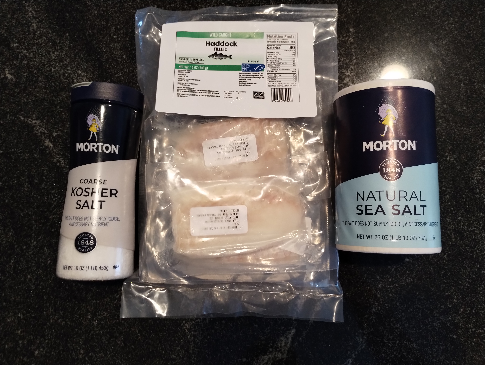</img>
> 
> Remove filets from packaging from frozen. 
>
> Rinse under cold water, then pat dry with paper towels.
>
> Place filets in a large stainless steel bowl. Cover generously with coarse kosher salt, or sea salt. 
>
> Cover with plastic wrap and let sit in a refrigerator for at least 48 hours.
>
> 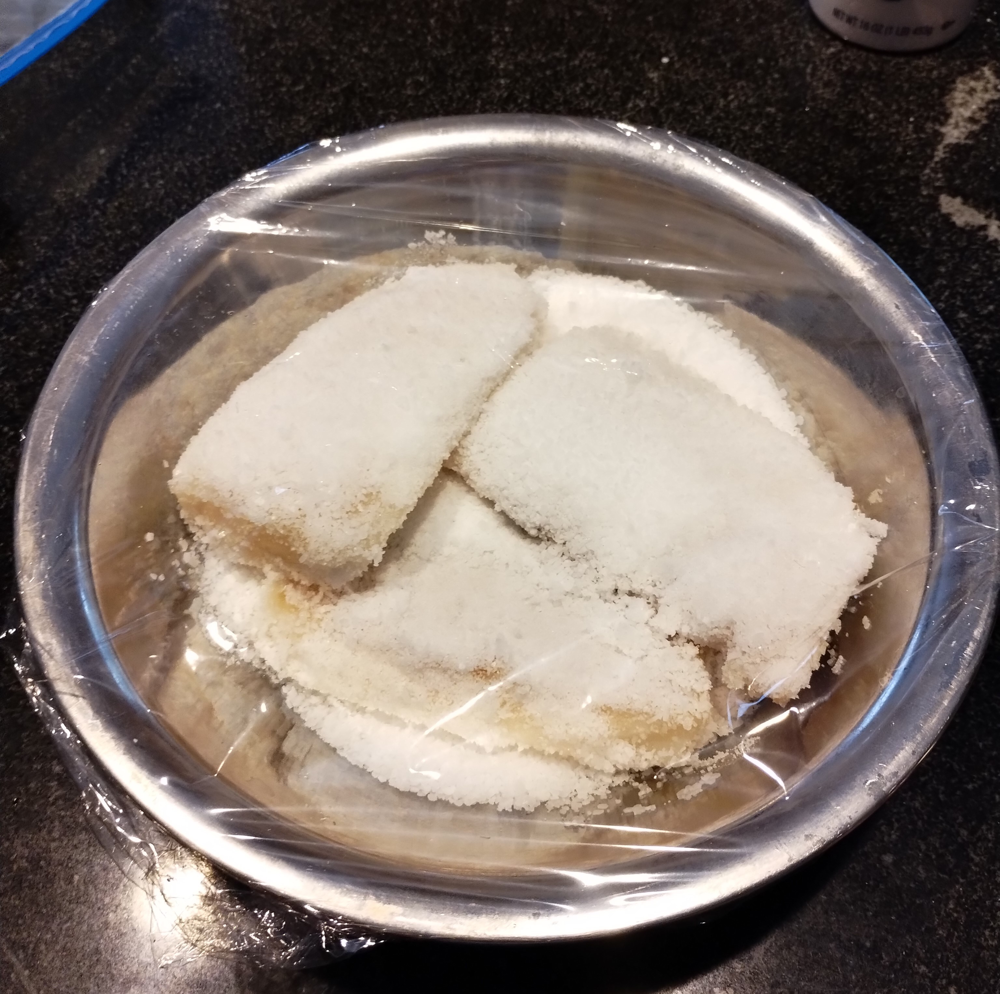</img>
>
> Remove from the fridge and rinse under cold water to remove excess salt. Pat dry again. Let sit on a rack in the fridge for 1-2 weeks to remove moisture from the fish. 
>
> To store, wrap in aluminum foil and can sit in the fridge for months!

---

- ### Arroz de Bacalhau
- `1 piece` salt fish cod/haddock (soaked for 30 min and drained prior to cooking)
- `1 cup` white rice 
- `2 cups` fish broth (from cooking)
- `1` medium tomato (diced)
- `1 tbsp` olive oil
- `0.5` red onion (cut into thin slices)
- `1` garlic clove (minced)
- `1.5 tbsp` butter
- kosher salt
- ground black pepper

> 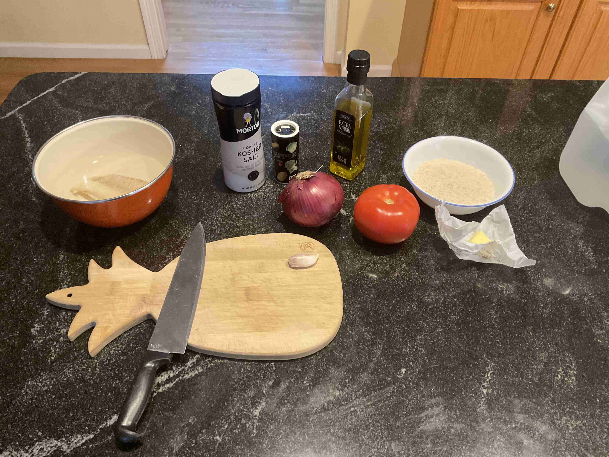</img>
>
> 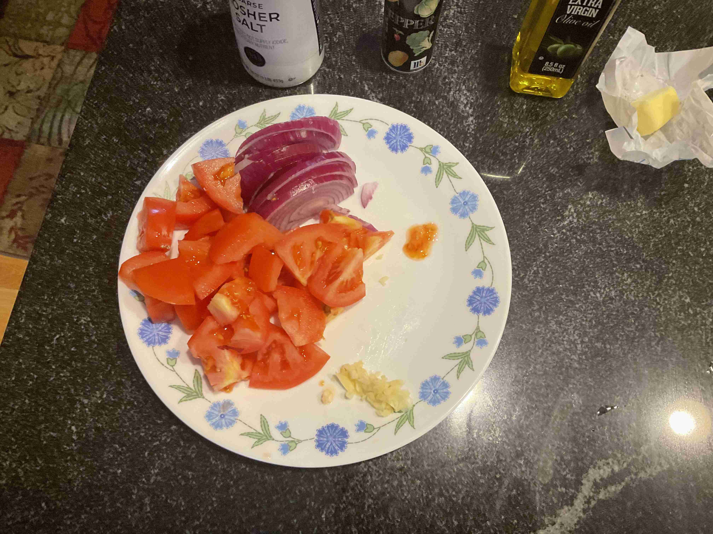</img>
> 
> Soak the dried bacalhau in cool water for 30 minutes, then drain.
>
> Place your bacalhau in a pot, cover it with boiling water. Bring it to a boil over high heat. Cook for 5 minutes. 
>
> 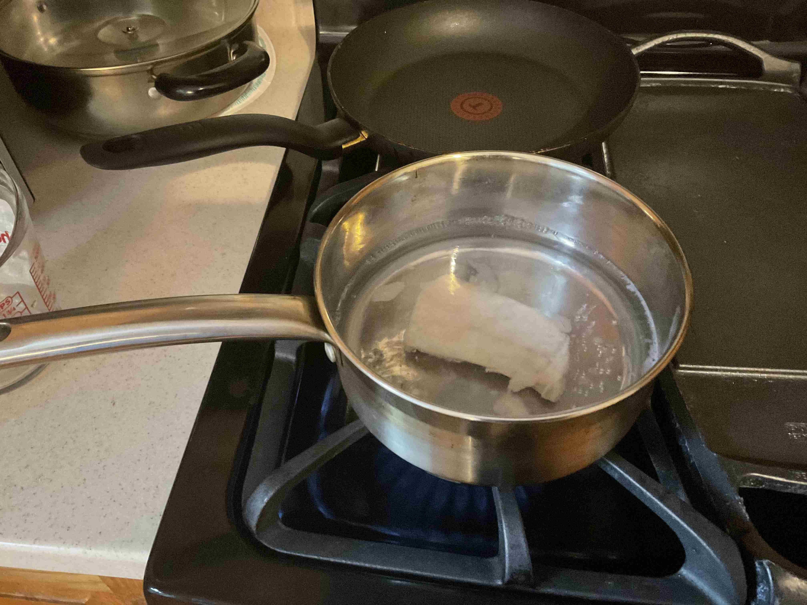</img>
>
> Drain the fish, reserve the water as it will be used to cook the rice later. Gently tear the bacalhau into smaller pieces with a fork or tongs and set aside.
>
> 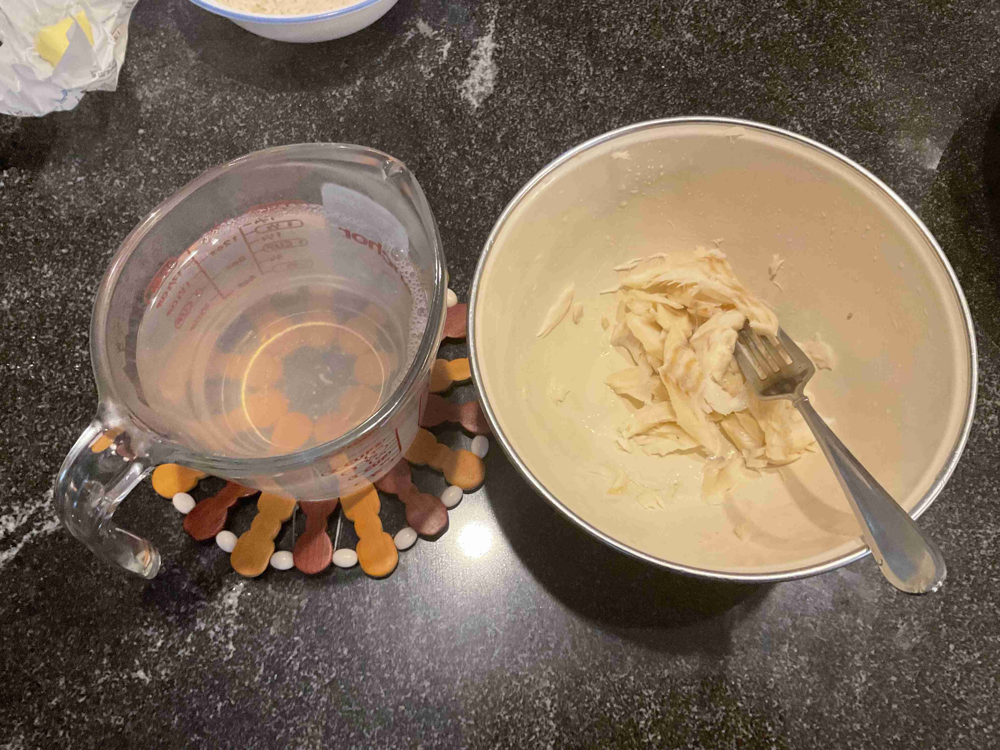</img>
>
> Place a large pot over medium heat. Allow it to heat up before you add the butter  and the onions. Cook for about 5 minutes until they start to soften and gain some color. 
>
> 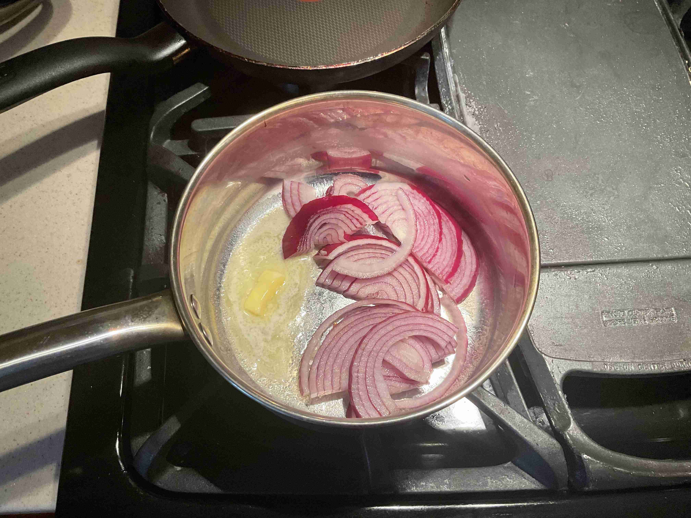</img>
>
> Push the onions to one side of the pan, add a drizzle of olive oil. Add the garlic, frying it for another minute or two.
>
> 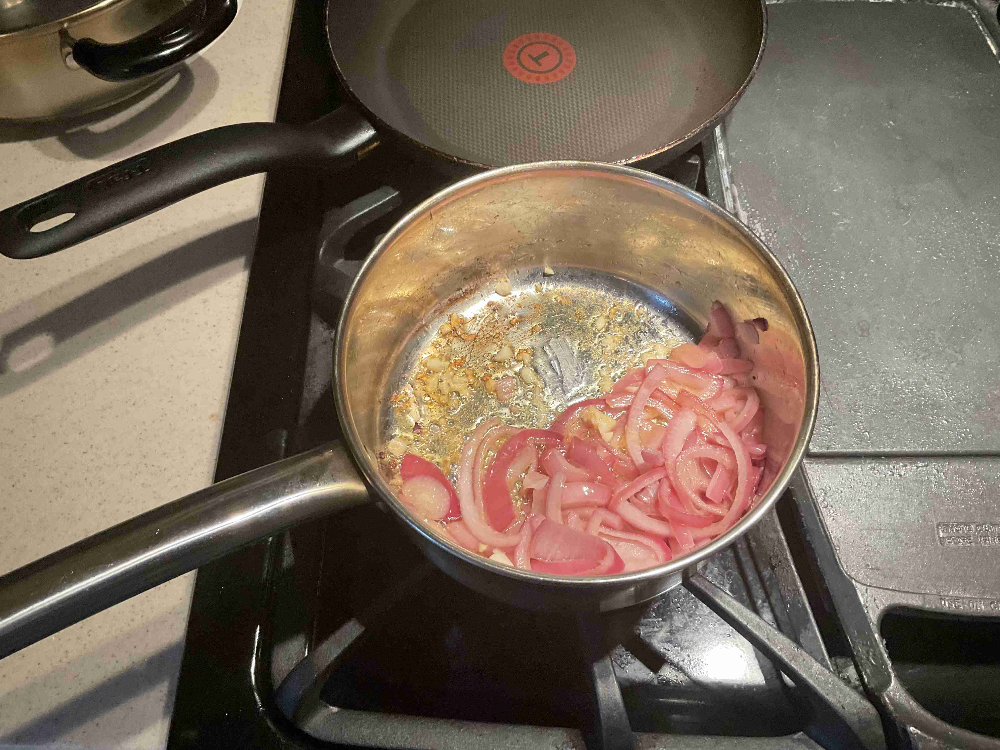</img>
>
> Add in the tomatoes, cook for another 5 minutes until they start to soften and release some juice. Add your codfish, stir well, allow everything to cook for another 2 minutes. 
>
> 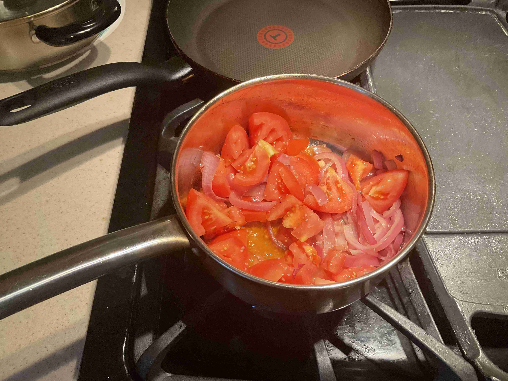</img>
>
> Add the rice to the fish and tomato mixture , fry for another 1 minute. Deglaze the pan with a splash of water if necessary.
>
> 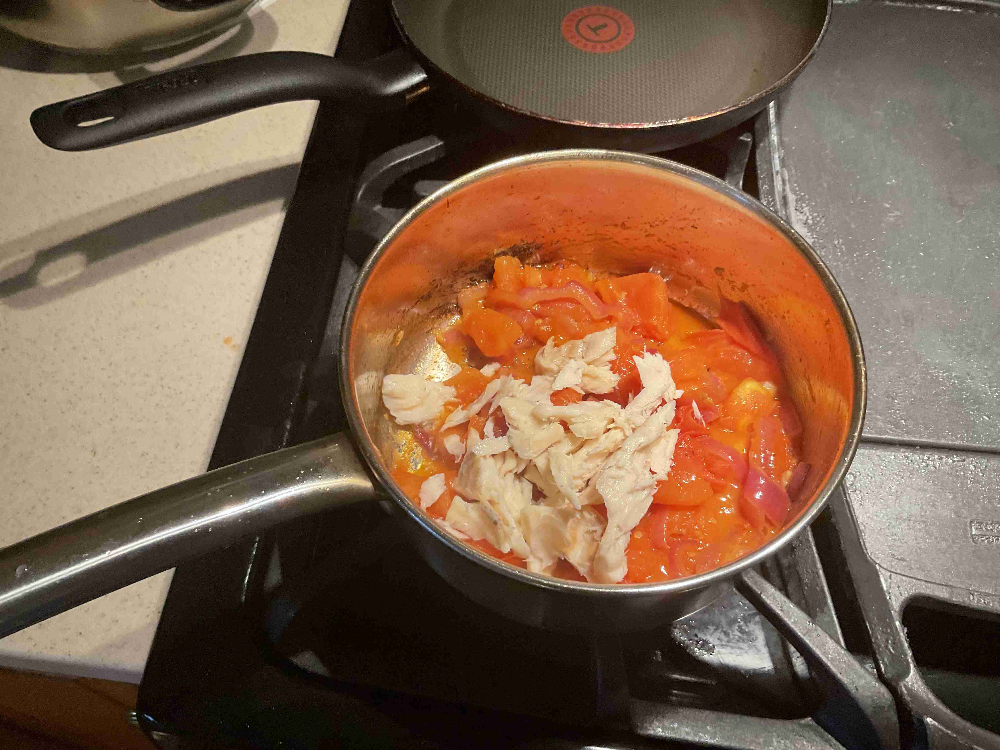</img>
>
> Start to add the water you used to cook the fish, slowly cup by cup over the course of 10 minutes (2 cups in total). Stir well in between additions and make sure the liquid is fully absorbed before you add more liquid. Cook with lid on.
>
> 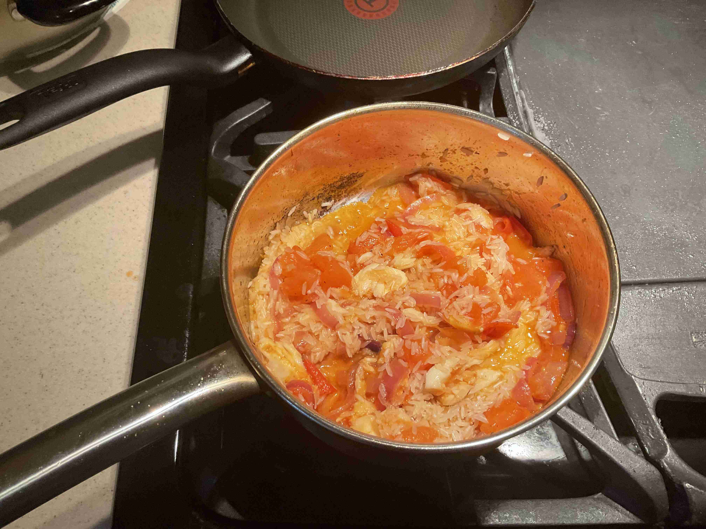</img>
>
> Cook until rice is fully cooked (15-25 minutes over medium heat) and the rice offers some resistance. Add salt and pepper to taste.
>
> 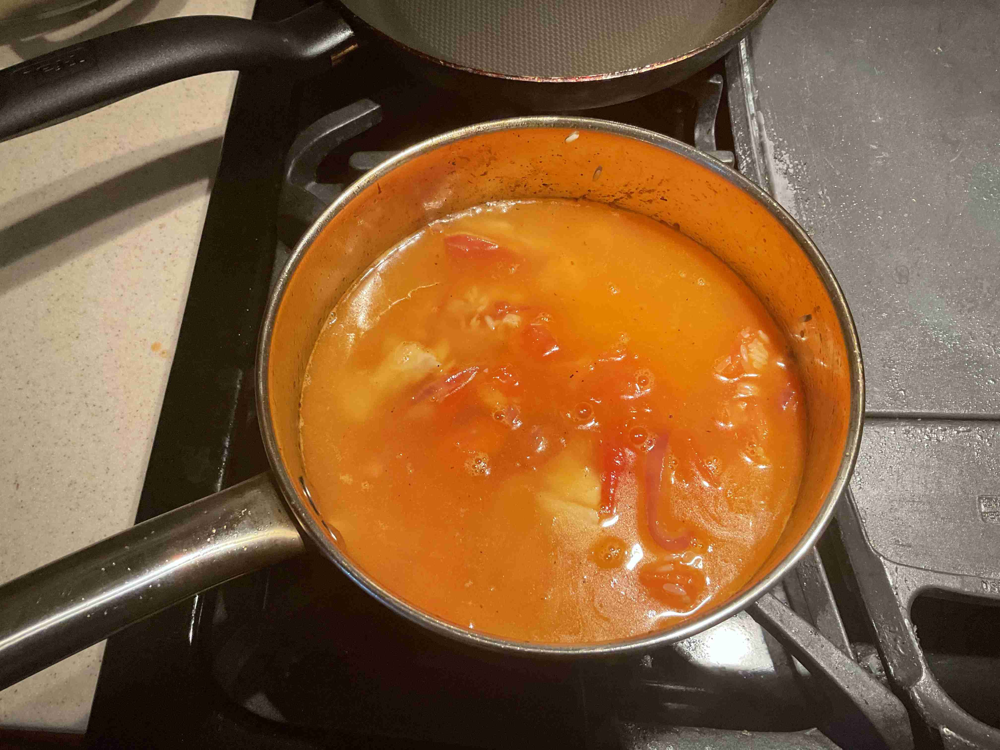</img>
>
> Serve while hot, enjoy!
>
> 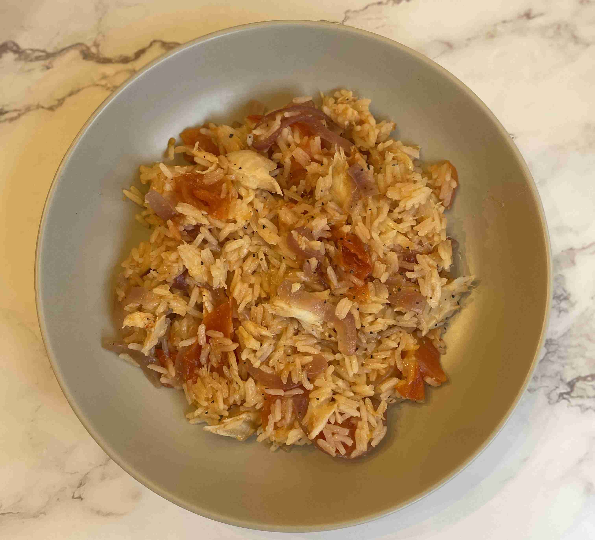</img>

