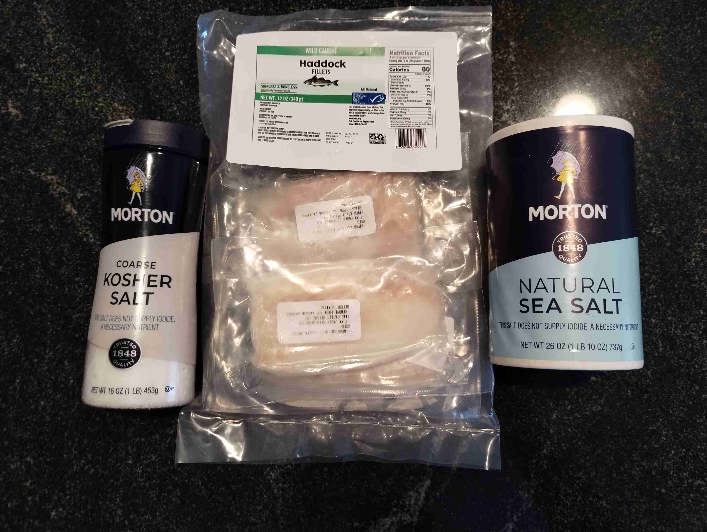

- ### Bacalhau Fresco
- `3/4 lb` haddock filets (or cod)
- `1 cup` coarse kosher salt (or sea salt)

> </img>
> 
> Remove filets from packaging from frozen. 
>
> Rinse under cold water, then pat dry with paper towels.
>
> Place filets in a large stainless steel bowl. Cover generously with coarse kosher salt, or sea salt. 
>
> Cover with plastic wrap and let sit in a refrigerator for at least 48 hours.
>
> </img>
>
> Remove from the fridge and rinse under cold water to remove excess salt. Pat dry again. Let sit on a rack in the fridge for 1-2 weeks to remove moisture from the fish. 

---

- ### Arroz de Bacalhau
- Coming soon!

> Coming soon!
