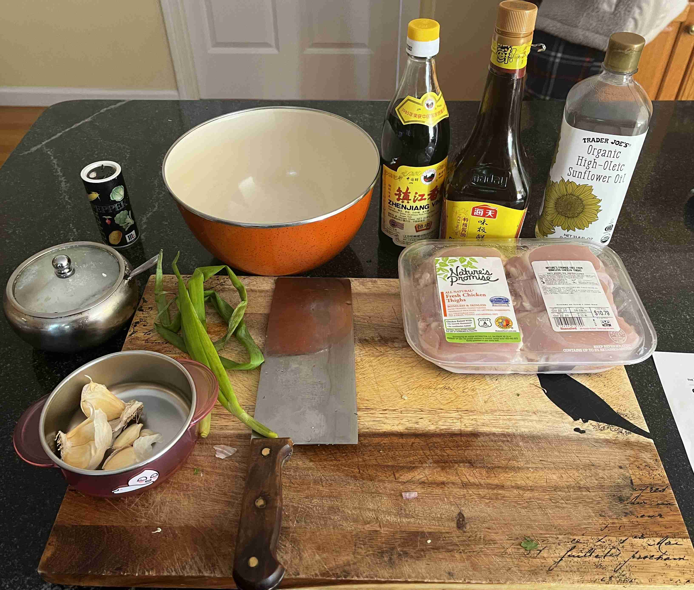
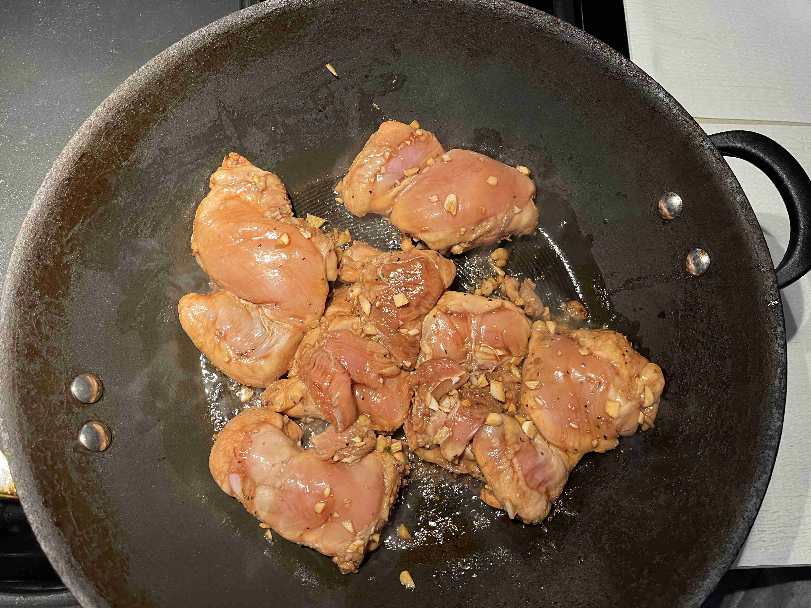
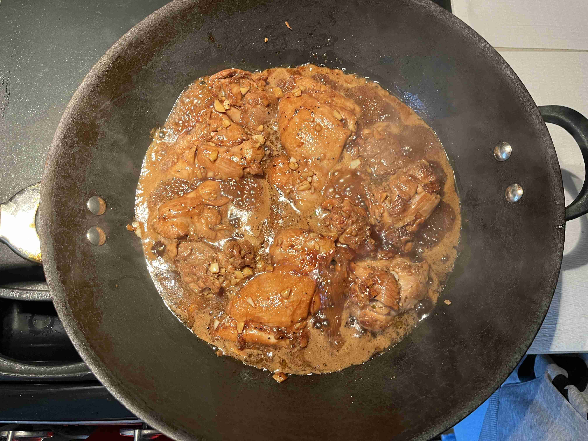
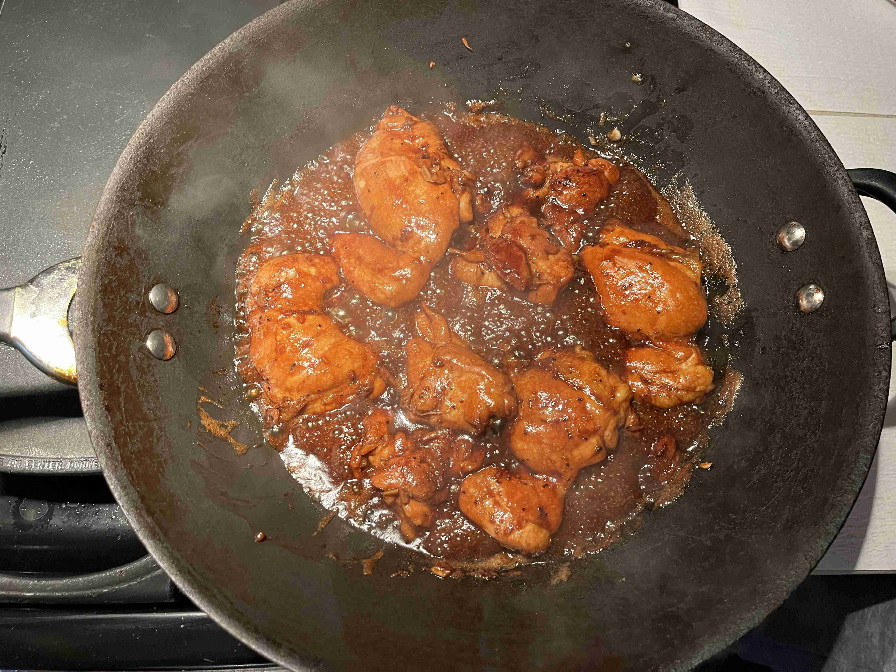
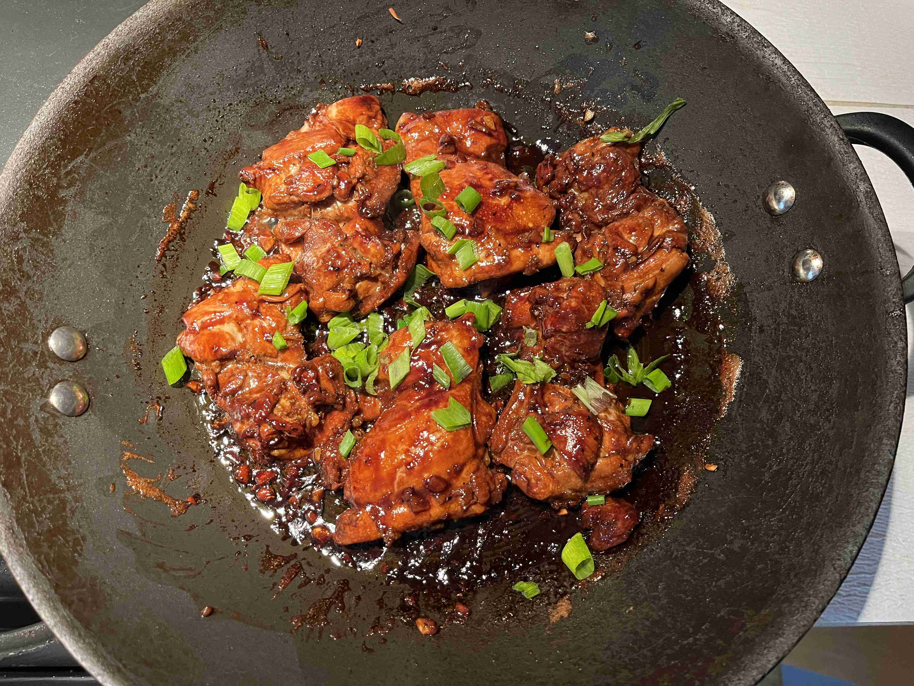

- ### Marinading
- `1/2 cup` dark vinegar
- `1/2 cup` soy sauce
- `8 cloves` garlic (minced)
- `1/2 tsp` black pepper
- `1.5 tbsp` sugar
- `2 lbs` boneless chicken thighs

> </img>
> 
> In a large bowl, combine vinegar, soy sauce, garlic, pepper, and sugar. Add chicken and toss to coat. Cover the bowl with plastic wrap and refrigerate for up to three hours.

---

- ### Cooking
- `1 tbsp` canola oil
- `4` green onions (thinly chopped)

> Heat oil in a large skillet over medium-high heat. Add only chicken pieces and brown both sides for 3.5 minutes each side.
>
> </img>
>
> Add remaining marinade to the skillet and bring to a boil. Lower heat to maintain simmer for 1 minutes. 
>
> </img>
>
> Flip chicken thighs. Simmer for an additional 10 minutes until sauce begins to thicken. When chicken is fully cooked, remove from heat.
>
> </img>
>
> Serve chicken thighs over cooked rice, sprinkled with green onions. Enjoy while hot!
>
> </img>
>
> Thanks to my friends for cooking this with me!

