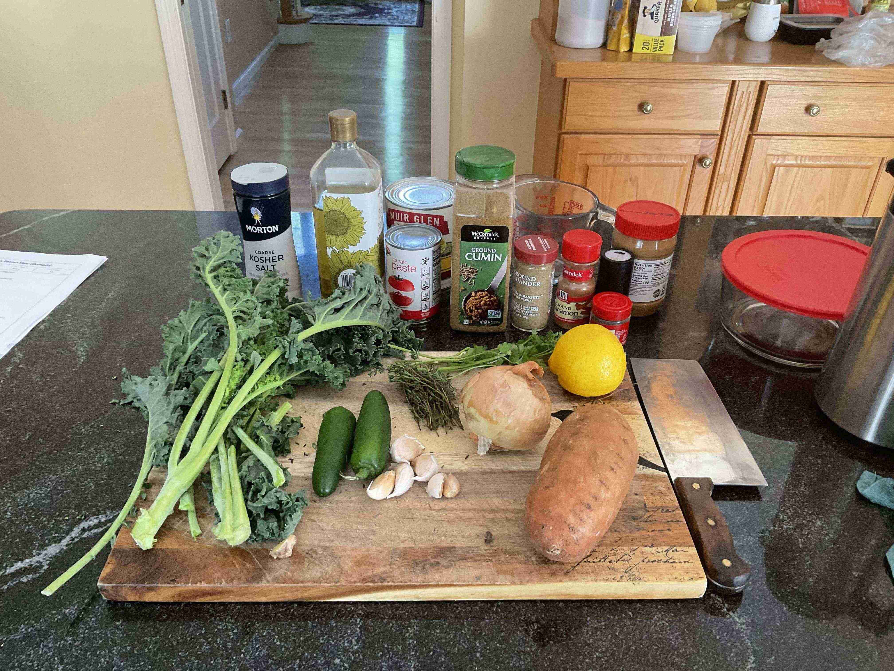
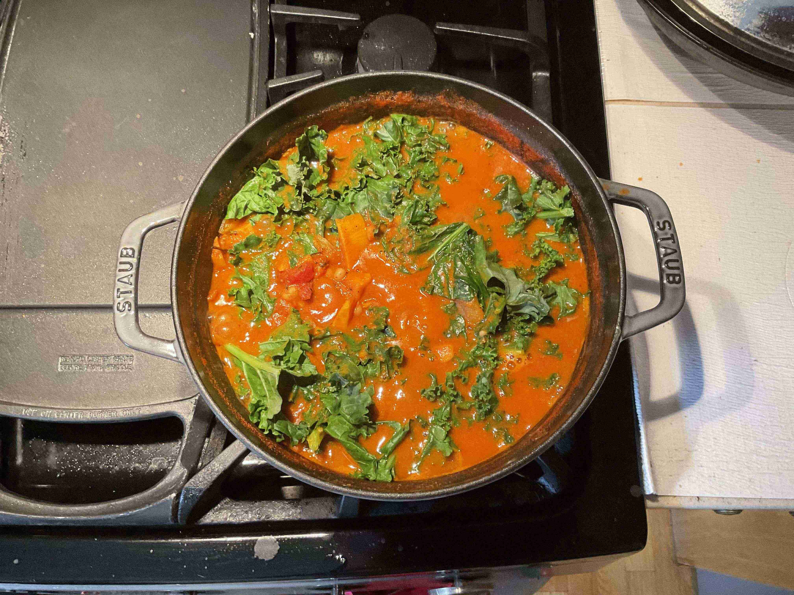

- ### Preparation
- `1` large yellow onion
- `6` garlic cloves
- `2 tbsp` ginger
- `2` japaleño peppers
- `1 tsp` ground cumin
- `1 tsp` ground coriander
- `1/4 tsp` ground cinnamon
- `1/4 tsp` ground cloves
- `1 1/2 tsp` kosher salt
- `1/2 tsp` black pepper
- `1 lb` sweet potatoes
- `1 handful` kale

> Dice the onion and place it into a bowl.
>
> Chop the garlic and place it into the bowl.
>
> Finely dice the ginger and place it with the garlic.
>
> Dice the jalapeño peppers and place them into the bowl with the onion. Remove as many seeds as you want (the more seeds the spicier).
>
> Mix all of the spices, salts, and peppers into a small bowl, set aside.
>
> Peel and dice the sweet potatoes into small less than 1/2 inch cubes, set aside.
>
> Chop the kale into medium sized leaves.

---

- ### Cooking
- `2 tbsp` sunflower oil
- `2 tbsp` tomato paste
- `1 pinch` of kosher salt
- `3 cups` water
- `1 handful` thyme sprigs
- `1/2 cup` creamy peanut butter
- `1 15oz can` navy beans
- `1 28oz can` crushed tomatoes
- `1 tbsp` lemon juice (from fresh lemon)
- `1/2 cup` cilantro, chopped

> Heat a large Dutch oven over medium-high heat. Add the sunflower oil to cover the bottom.
>
> Once the oil is heated, add the onions with a pinch of salt and cook for 5 minutes, stirring occasionally.
>
> Add the garlic, ginger, and jalapeño peppers and cook for 2 minutes, stirring occasionally.
>
> Add in tomato paste, cumin, coriander, cinnamon, cloves, salt, and pepper (spice mix from prep). Cook for 2 minute, stirring constantly. Add in a splash or two of water to prevent sticking.
>
> Pour in the water and add the thyme sprigs, sweet potatoes, peanut butter, beans, and tomatoes. Bring to a boil and stir well.
>
> > > If the crushed tomatoes and beans come with a lot of water, reduce the amount of water added to 2.5 cups.
>
> Reduce heat to medium and simmer for 25-30 minutes, stirring occasionally.
>
> Add chopped kale and simmer for an additional 5 minutes.
>
> Stir in lemon juice and cilantro, and season to taste. Let cool for 5 minutes, and serve with rice.

--- 

- ### More Content!

> Watch me get Gambia on the country picker!
>
> <video src="domodawheel.mkv" width="100%" controls muted=""></video>
> 
> Here are some more pictures throughout the process of cooking the stew. It was a mess at first since I put too much water (or too much sweet potatoes), so I had to scoop water out midway, the consistency turned out alright at the end, however. The simmering process did not boil out as much water as I had hoped to either.
> 
> </img> 
> 
> </img>
>
> </img>
>
> </img>
