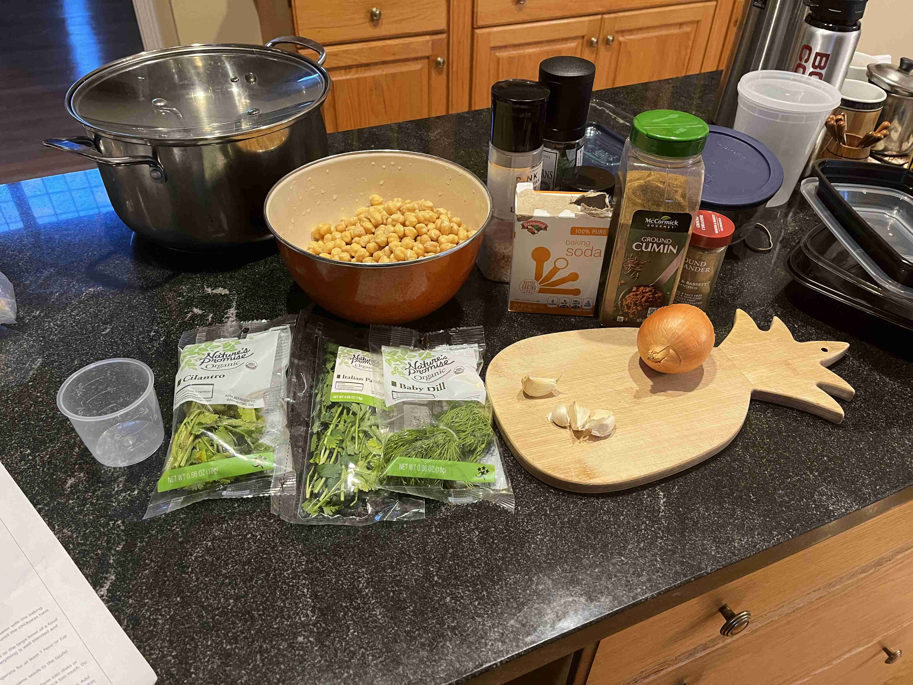
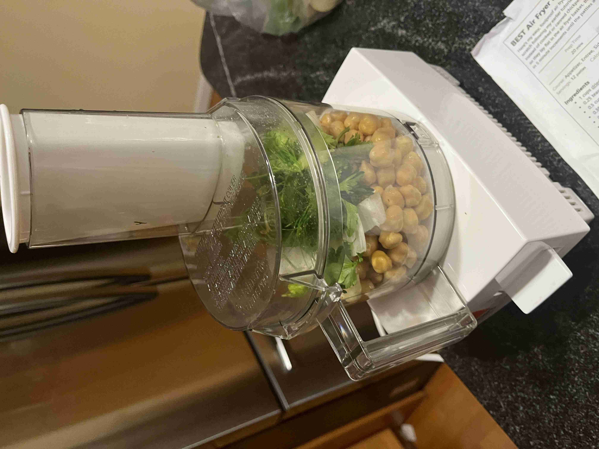
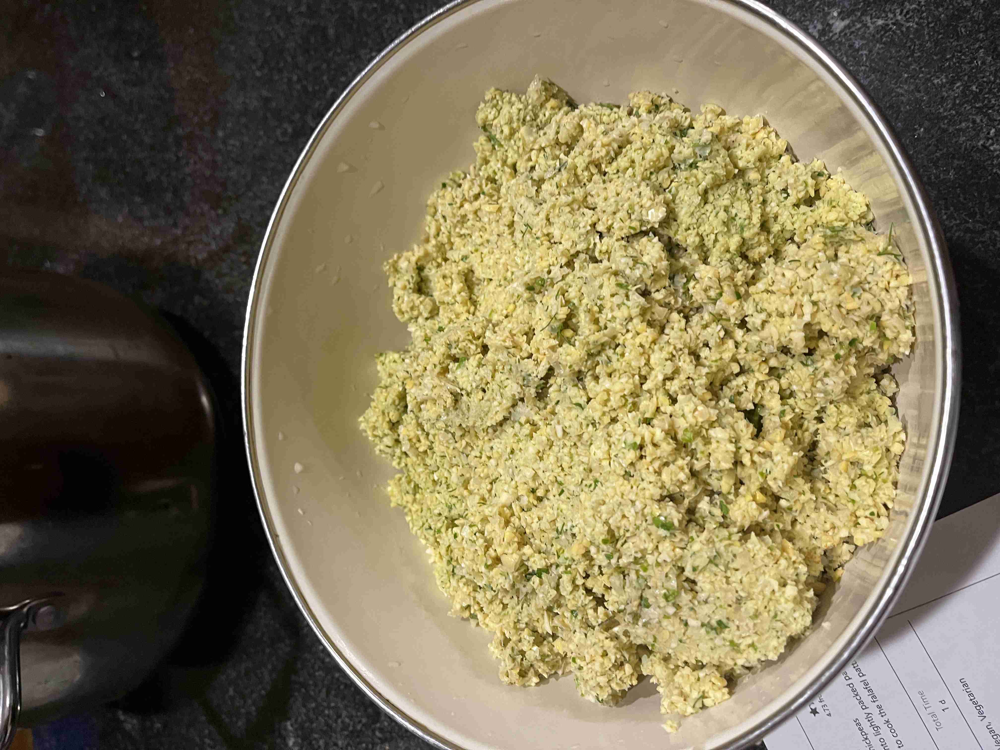
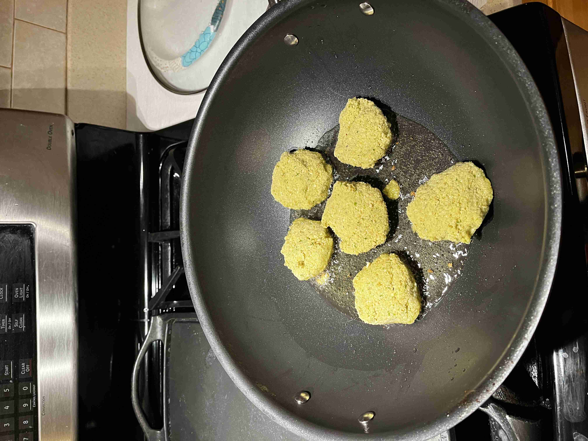
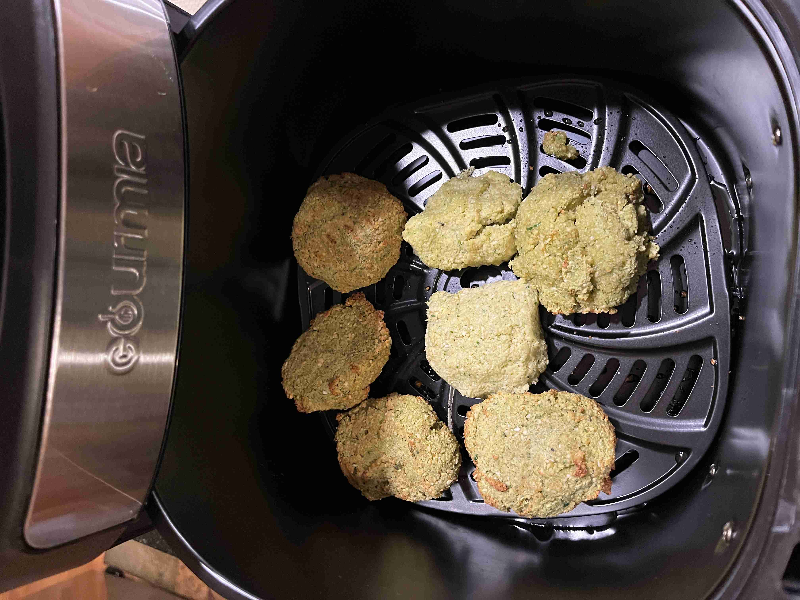

- ### Preparation (Falafel Dough)
- `1 cup` dried chickpeas
- `0.5 tsp` baking soda
- `1 cup` chopped parsley (stems removed)
- `0.75 cup` cilantro leaves (stems removed)
- `0.5 cup` dill (stems removed)
- `1` small onion
- `4 cloves` garlic
- `1 tsp` salt
- `1 tbsp` ground cumin
- `1 tbsp` ground coriander
- `2 tbsp` sesame seeds

> </img> 
> 
> Soak and cover the chickpeas in water overnight. Drain the chickpeas and let them dry for 30 minutes.
>
> </img> 
>
> Add all ingredients into a food processor, by portioned batches if needed. Process until the mixture is finely ground and like playdough consistency when you squeeze it in your hand.
>
> </img> 
>
> Leave dough in the fridge for 1 hour.

---

- ### Frying (Air/Pan Frying)
- `1/3 cup` canola oil
- `1/3 tsp` extra virgin olive oil
- `1/2 tsp` baking soda

> Add baking powder to the mix and stir with spoon vigoruously.
>
> Form falafel patties (2 inches in diameter, 0.5 inches thick). Set aside.
> 
> Heat a large skillet or pan with vegetable oil over medium heat. At the same time, pre-heat an air fryer to 400°F.
>
> </img> 
>
> Once heated, fry the patties in batches so that a crispy layer forms on the top and the bottom of the patties. Remove from pan.
>
> Immediately, transfer to air fryer to cook for 5-10 minutes, or until all edges are browned.
>
> </img> 
>
> Serve while hot with hummus, pita bread, or tahini sauce. Enjoy!

