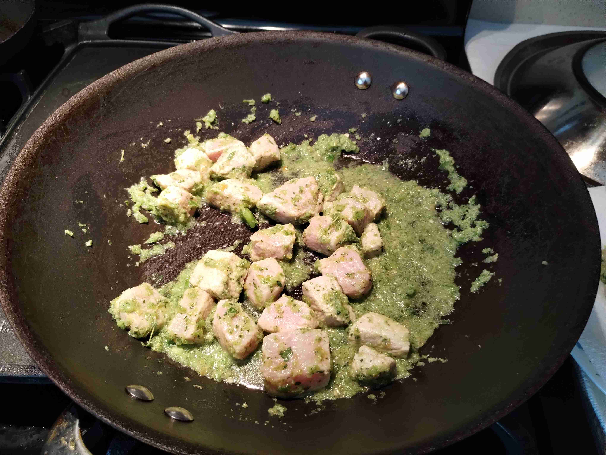

- ### Epis (Haitian Seasoning)
- `2/3` green bell pepper (chopped roughly, stems removed)
- `1` shallot
- `2` scallions
- `3` sprigs thyme
- `1 handful` parsley
- `1` habanero pepper (seeds + stem removed)
- `1.5 tbsp` olive oil

> </img>
> 
> Combine all ingredients in a food processor. Blend until smooth yet with subtle texture. Set aside.
>
> </img>
>
> </img>
>
> </img>

---

- ### Marinating Pork (Overnight)
- `1 lb` pork chop
- `0.25` tbsp salt
- `1.5` limes (juiced)
- `1` chicken bouillon cube (crushed)
- `5 stems` parsley
- `5 stems` thyme
- `0.5 cup` Epis (Haitian Seasoning)
- `0.25 tbsp` Adobo salt

> </img>
> 
> Coat pork with lime juice and salt. Mix to combine. Let sit for an hour.
>
> Rinse pork to remove juice and salt. Add to a large bowl and add chicken bouillon, parsley, thyme, Adobo, and Epis. Mix to combine. Cover and refrigerate overnight.
>
> </img>

---

- ### Cooking Pork
- Marinated pork
- `2.5 cup` vegetable oil

> In a separate pan, simmer the pork with the marinade for 5-6 minutes, or until the pork is just cooked through. Remove from heat and set aside on paper towels. Pat dry.
>
> </img>
> 
> > > Don't overcook it!
>
> In a deep fryer, heat the vegetable oil to 350 degrees. Add the pork to the oil and fry for 3 minutes, or until the pork is golden brown and crispy. Remove from heat and set aside on paper towels to let the oil drain.
> 
> > > Fry in batches so the pork can be cooked thoroughly.
>
> </img>
>
> </img>
>
> </img>

--- 

- ### Fried Plantains
- `2` plantains (ripe/blackened)

> In a separate pan, heat `0.5 cup` oil from deep frying over medium heat. 
>
> In the meantime, slice the plantains across into 1/2 inch thick slices. Add the plantains to the oil and fry for 5-6 minutes on each side, or until golden brown. Remove from heat and set aside to dry. 
>
> </img>
>
> Serve the pork (griot) with the plantains while hot. Enjoy!

