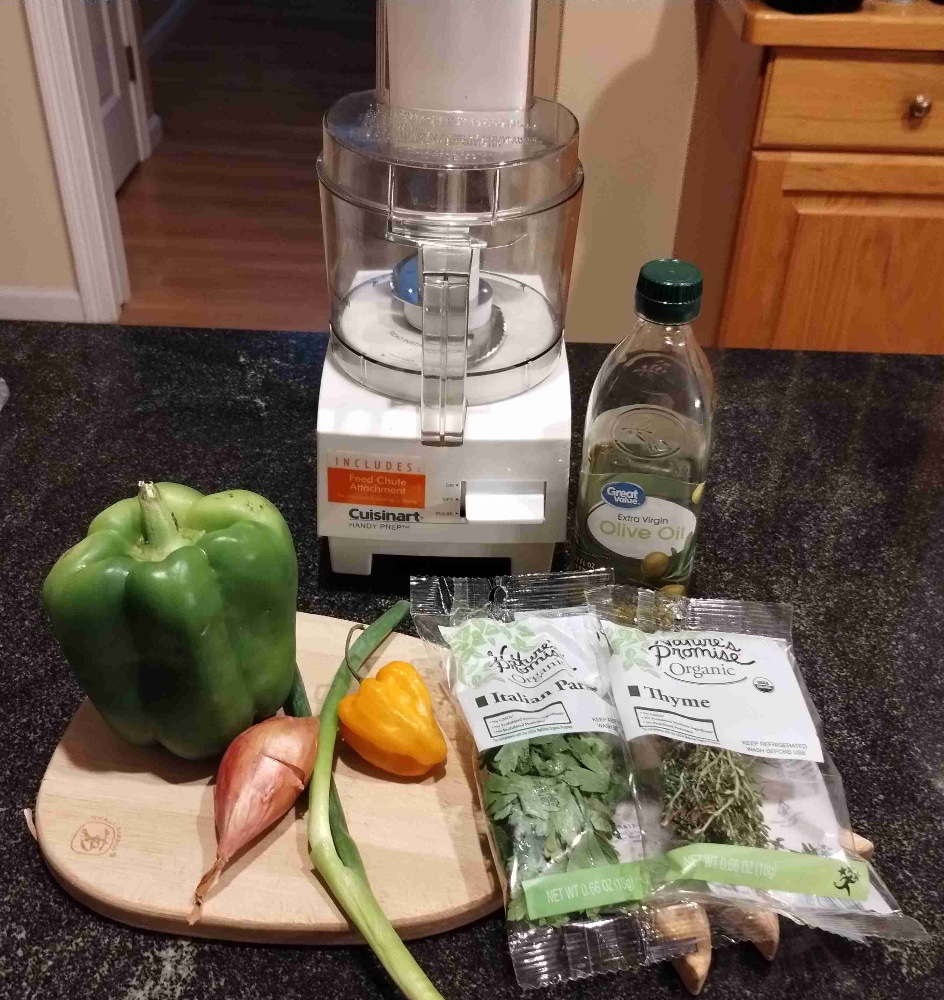
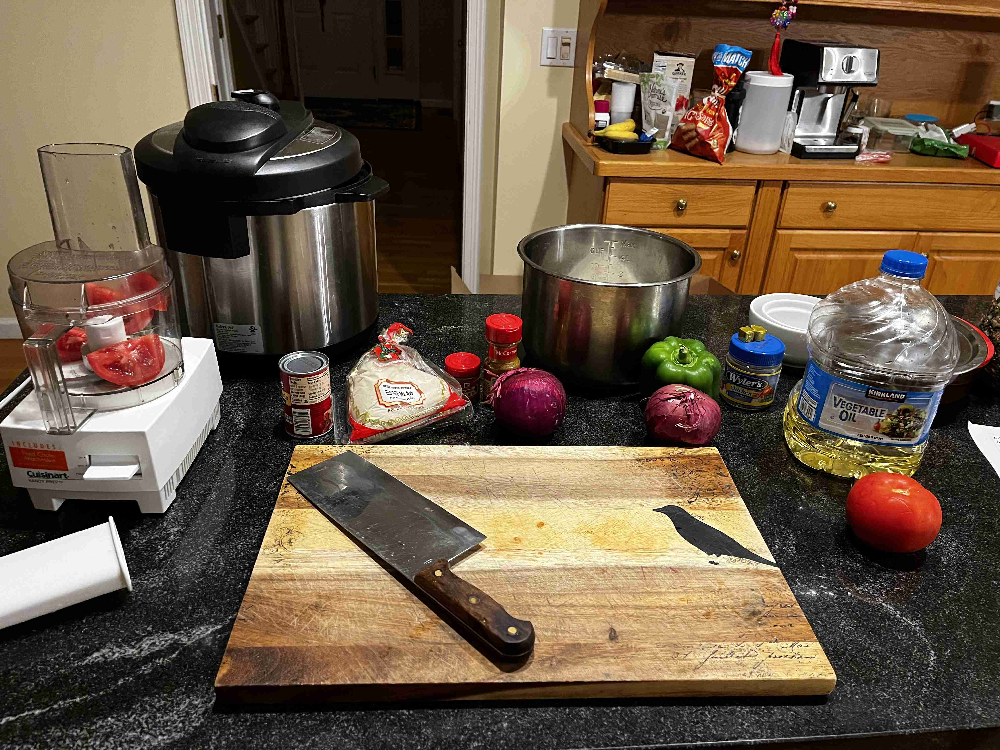

- ### Preparation
- `1` vine-ripened tomato
- `1` green bell pepper
- `1` red onion

> Blend these ingredients in a food processor until smooth. Set aside one cup.
>
> </img>

---

- ### Cooking
- `2` cups jasmine rice (or some other long grain rice)
- `1/3` cup vegetable oil
- `1 cup` mix (from above)
- `1` red onion (diced)
- `2 tbsp` tomato paste
- `2` cups chicken broth (from 2 cups chicken bouillon cubes)
- `1 tbsp` curry powder
- `1 tbsp` ground thyme
- `1 tsp` white pepper
- `1` vine-repened tomato (sliced)
- `0.5 tbsp` kosher salt

> </img>
> 
> Set instant pot to saute mode and add vegetable oil. Add chopped onions and tomato paste. Stir and fry for 2-3 minutes.
>
> </img>
>
> Add in the blended mix, curry powder, thyme, white pepper, and salt. Stir and fry for 2-3 minutes.
>
> Turn off saute mode. Wash rice until water runs clear. Add rice to the pot and stir to combine. Add sliced tomatoes on top.
>
> </img>
>
> Add chicken broth and stir to combine.
>
> Set instant pot to "rice" mode. Cook until done, about 20 minutes in total.
>
> After the instant pot depressurizes, open the lid and serve while hot!