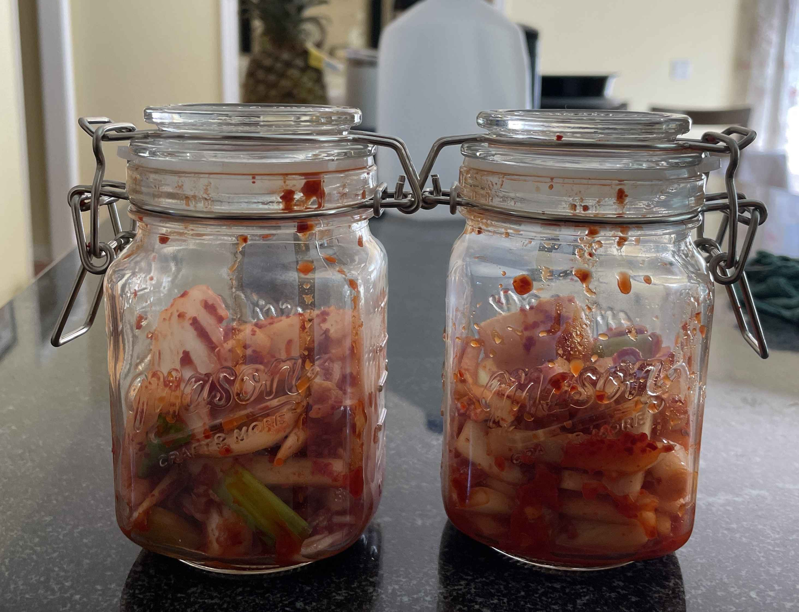

- ### Preparation
- `1/2` medium-sized napa cabbage
- `2 tbsp` sea salt
- Water
- `2 cloves` garlic (minced)
- `1/2 in` ginger (minced)
- `1/2 tsp` sugar
- `2 tbsp` fish sauce (Thai Kitchen) or `3 tbsp` spring water for a vegan alternative
- `2.5 tbsp` gochugaru (Korean red pepper flakes)
- `4.5 oz` daikon radish (peeled and cut into matchsticks)
- `2 scallions` (trimed and cut into 1-inch pieces)

> </img>
> 
> Cut the cabbage into a half through the center. Then, cut the cabbage half through the stem into quarters. Cut the core out. Then, cut each quarter crosswise into 2-in wide strips.
>
> Salt the cabbage. Place the cabbage into a large bowl and mix in the salt well. Massage the salt into the cabbage and add water to cover. Cover and let sit for 1 hour.
>
> </img> 
>
> Rinse and drain the cabbage under cold water. Let dry in a colander for 15 minutes.
>
> > > Use spring water for best results! Chlorinated water (or tap water) can prevent fermentation.
>
> Rinse and dry the bowl used for salting. Add garlic, ginger, sugar, fish sauce, and stir into smooth paste. Then, stir in gochugaru. Set aside.
>
> Squeeze any remaining water from the cabbage and add it to the spice paste. Add radish and scallions. 
>
> Mix all of the vegetables together until thoroughly coated. Use gloves!
>
> <video src="kimchimix.MOV" width="100%" controls muted=""></video>

---

- ### Fermentation
- Mix from above
- `1/2 quart` mason jar with airtight lid.

> Place the mix from above into a jar. If there is not enough brine to cover the kimchi mix, add a mixture of water and seasalt in the proportion of 1 cup water 1.5 tsp salt. 
> 
> Let ferment for 1 to 5 days. Check the kimchi every day to ensure it is fermenting properly. If it is too sour, it is overfermented. If it is not sour enough, it is underfermented. You may see bubbles inside the jar. After 1-2 days, transfer the kimchi to the fridge.
>
> Watch my progress on fermentation below!
>
> **Day 1 (Prep Day)**
>
> </img> 
>
> **Day 2**
>
> There wasn't enough brine, so I added a mixture of sea salt and water. Tip of the day for food photagraphy: when taking pictures horizontally, make sure the food lines up with the horizon and side lines.
>
> </img> 
> 
> **Day 3**
> 
> </img> 
>
> Today, I saw a few bubbles come up when opening the lid. I then pressed down on the kimchi a few times to keep it under the brine, then transferred it to the fridge. I will taste it tomorrow to make sure it is on track!
> 
> **Day 4**
> 
> </img> 
>
> I tasted the kimchi and it has a slightly sour taste with a good amount of salt and spice. I hope that in the next two days, it will ferment enough to form the full kimchi umami taste, and am very excited for the final product!
> 
> **Day 5**
> 
> </img> 
>
> I tasted the kimchi with a chopstick (again) and pushed down on the kimchi to keep it under the brine. Make sure that you taste it AFTER you push it down, to prevent contamination and such. It tastes a little more sour from the previous day, but still has a good amount of salt and spice. I will cook up a kimchi fried rice tomorrow!
> 
> **Day 6 (Ready to Eat!)**
>
> Coming soon! I might make the kimchi with fried rice. Fun fact: I went on a Hannaford's spree to get garlic and fish sauce since we ran out midway! My sister also told me some tips for taking pictures of food: hold the camera at a completely horizontal, 45 degree, or directly above the food in question.

--- 

- ### Kimchi Fried Rice

- `1/2 cup` kimchi
- `1 bowl` of refrigerated cooked white rice
- `1/2 tbsp` sesame oil
- `1 tsp` salt
- `2 oz` spam (chopped into small cubes)
- `1 tbsp` vegetable oil
- `1` green onion (chopped into 1/2-in pieces)

> This is a on-the-spot recipe I thought of when looking through ingredients in my kitchen. Below are some steps (and pictures!) of the process of using kimchi.
>
> In a large wok, heat the vegetable oil over medium heat. 
> 
> Add the spam and cook until browned, about 4 minutes. 
> 
> Then, Add the rice and kimchi simultaneously cook for 5 minutes, stirring occasionally.  
> 
> Drizzle the sesame oil and salt over the rice and cook for 1 minute. Serve hot.
>
> > > Using the rear side of your spatula, press down on the rice hard to break up any clumps. Chopping will not be sufficient.
>
> Serve with green scallions (optional). Enjoy!