- ### Preparation
- `2` yellow onions (sliced thinly)
- `1 cup` lentils
- `1 cup` jasmine rice
- `15 oz` canned fully-cooked chickpeas
- `1 tsp` kosher salt
- `1 tbsp` flour

> 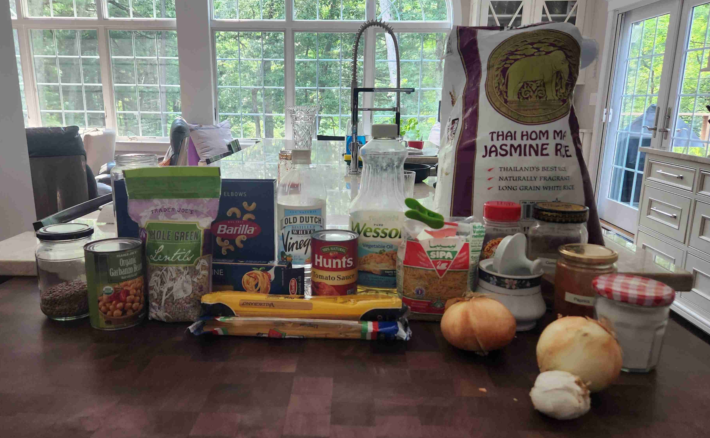</img> 
> 
> Soak lentils for 30 minutes to an hour in cold water in a large bowl. 
>
> Wash the rice in a large bowl until the water becomes clear.
>
> Rinse out the chickpeas under cold water. Let sit in a drainer. 
>
> Place the onions in a large bowl, and cover with flour and salt. Mix until coated evenly. 

---

- ### Caramelized Onions
- `1/3 cup` vegetable oil

> Heat a large skillet or pan with vegetable oil over medium heat. 
>
> Once heated, cook the onions until caramelized or very brown. Fry in batches so that the onion slices are not overlapping.
>
> 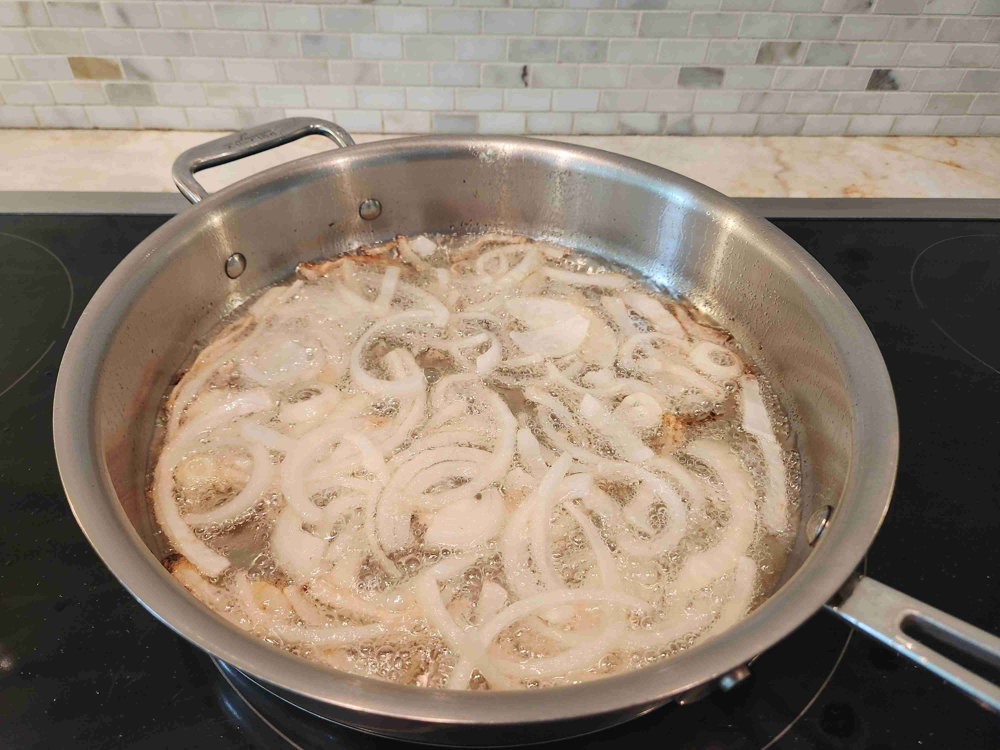</img> 
>
> Once caramelized, place onto several paper towels, so that the oil can drain from the onions. Pat the onions dry with another towel.
>
> 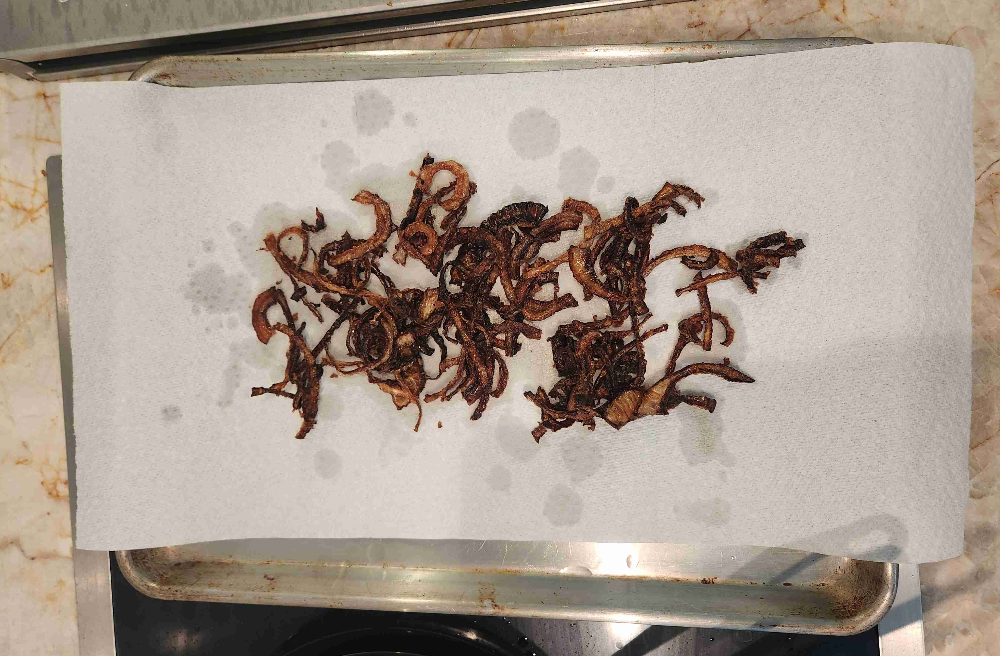</img> 

---

- ### Pasta
- `1/2 cup` elbow pasta
- `1 cup` rotini pasta
- `1 handful` linguini pasta

> In a pot of boiling salt water, cook the pasta combined al dente. 
>
> 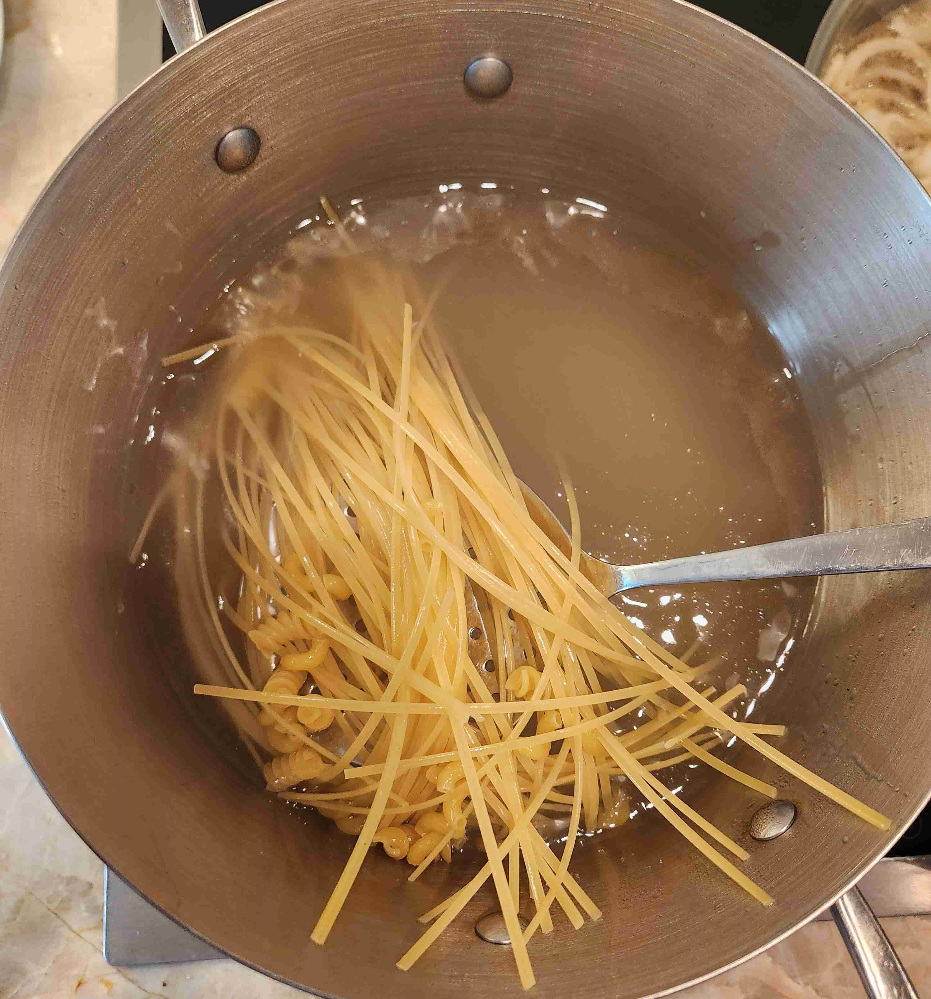</img> 
>
> > > Make sure to drop the pasta into the water at varying times based on the time to cook.
>
> Drain the water, then add 2 tbsp of the oil from the previous step from the onions to the pasta and mix thoroughly.
>
> 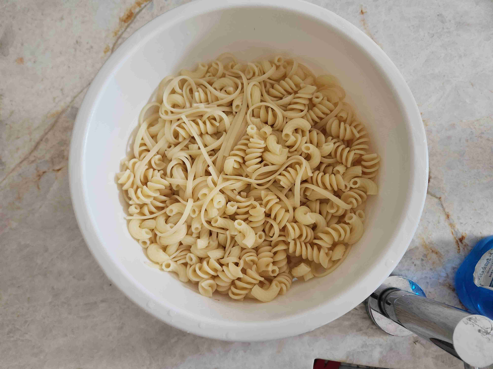</img> 

---

- ### Rice
- `1/4 cup` thin cut vermicelli/angel hair
- `2 cups` water

> Coat the bottom of a nonstick pot with oil from frying the onions and heat over medium heat. 
>
> 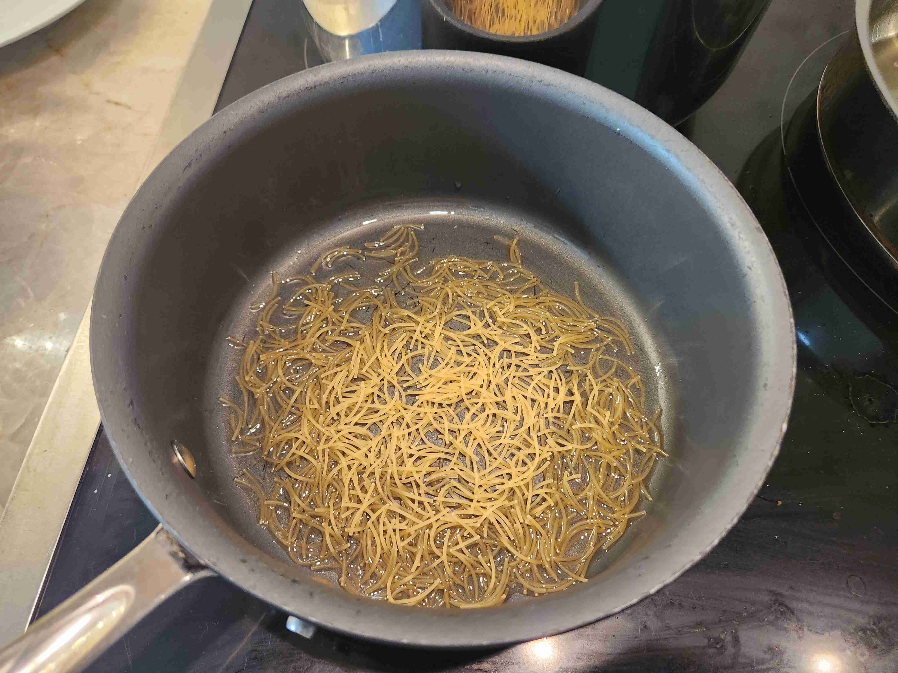</img> 
>
> Gently toast the vermicelli from the oil until golden brown.
>
> Then, add the rice and 2 cups of water and cook for 15 minutes with the lid on, or until done.
>
> 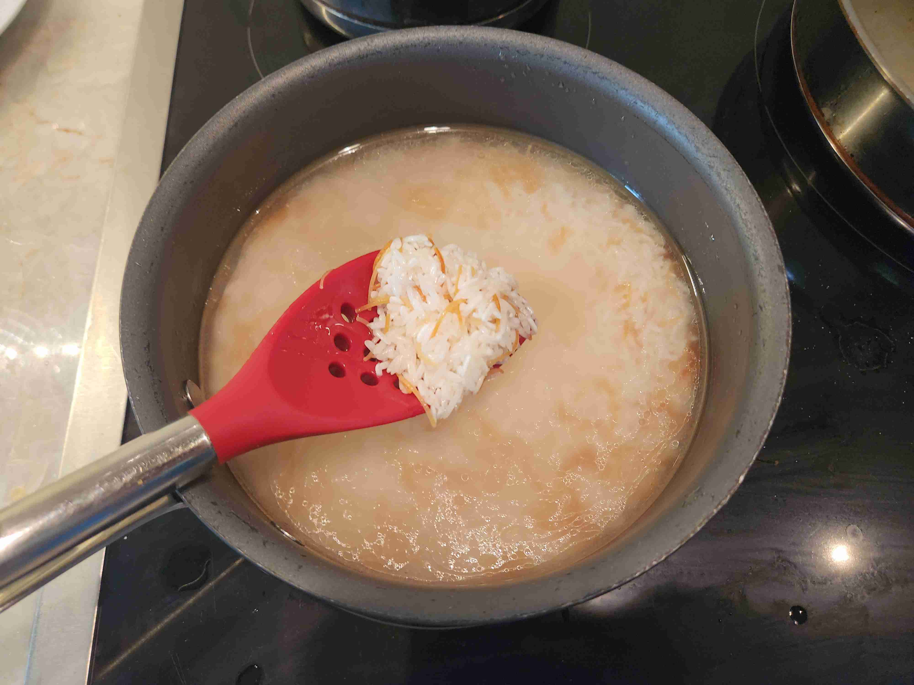</img> 
>
> 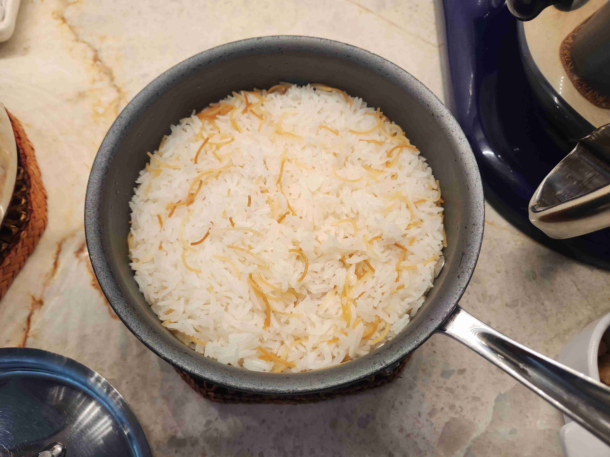</img> 

---

- ### Lentils
- `2 tbsp` ground cumin

> Coat the bottom of a pot with the oil from frying the onions. 
> 
> Add the lentils to the pot. Add water until covered. 
>
> 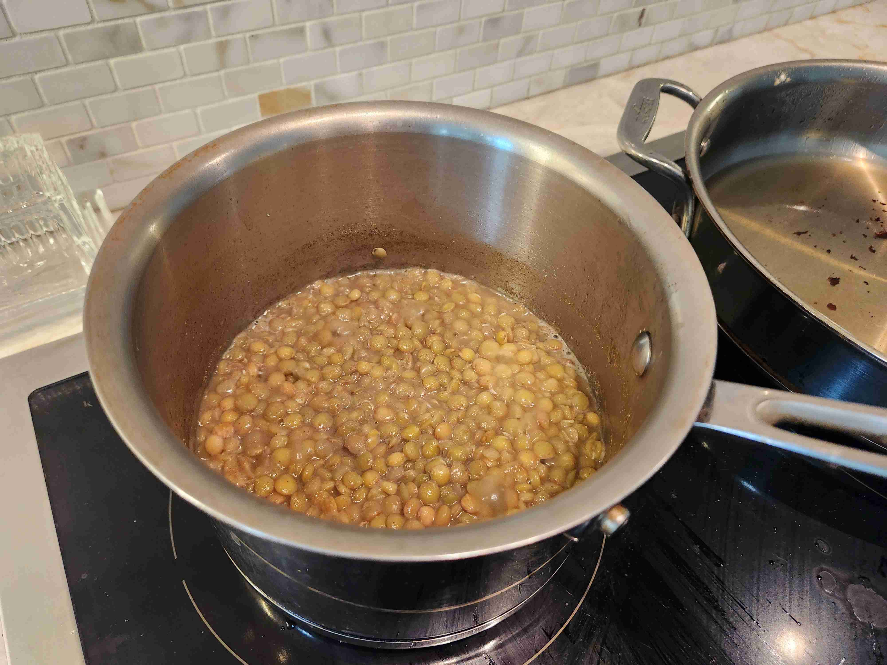</img> 
> 
> Add ground cumin to the mix. 
>
> Cook over medium heat for 12-15 minutes, or until cooked.

---

- ### Tomato/Red Sauce
- `15 oz` canned tomato sauce
- `1 tbsp oil` (from frying onions)
- `5 cloves` garlic (minced)
- `2 tsp` salt
- `1 tsp` sugar
- `2 tbsp` white vinegar
- `0.5 tsp` paprika
- `0.5 tsp` red chili powder
- `1 tsp` ground cumin

> Coat the bottom of the pan with oil from frying the onions. Heat over medium heat. 
>
> Add minced garlic to the pan. Once golden brown, add the tomato sauce, salt, sugar, white vinegar, paprika, chili powder, and ground cumin to the sauce. 
> 
> Simmer with a lid for 8 minutes, or until the sauce thickens.

--- 

- ### Serving

> 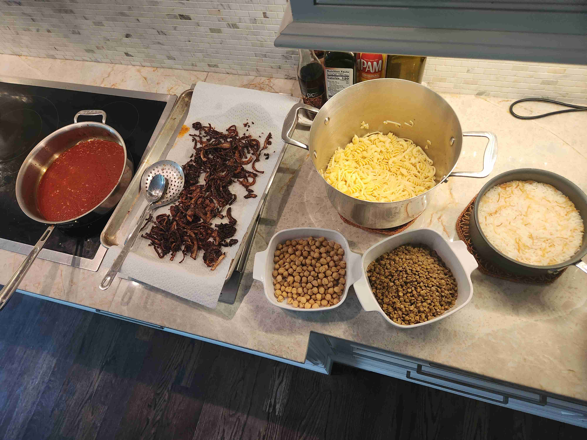</img> 
> 
> Place the rice and vermicelli on the bottom. Then, plate the koshary in the following order (bottom to top): rice, pasta, lentils, sauce, chickpeas, onions. Serve while hot and mix well. Enjoy!
>
> Watch the video below of me serving a plate to David Barsoum! Thank you to David for allowing us to cook with him at his house! Also shoutout to Ashwina and Nicole for being there and helping out along the process!
>
> <video src="kosharyserve.mp4" width="100%" controls muted=""></video>
>
> 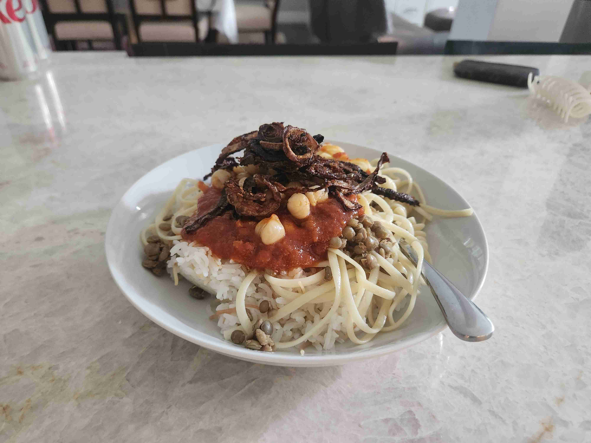</img> 
>
> 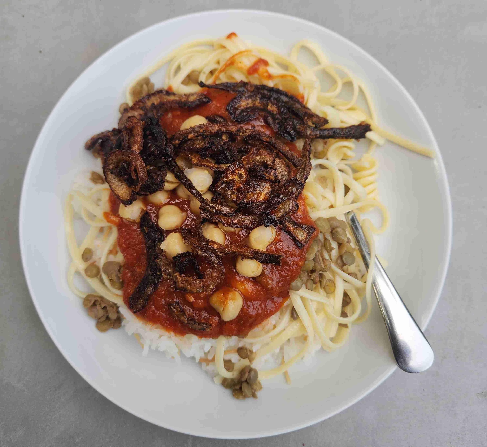</img> 

