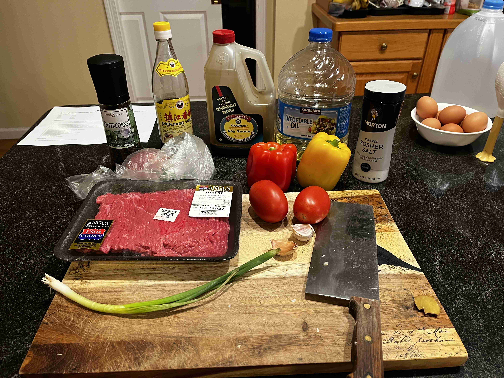

- ### Cooking
- `1 lb` stir-fry beef slices (or sirloin steak, cut into 1/4-inch strips)
- `1/4 cup` vegetable oil
- `1` medium red onion, cut into 1/2-inch slices
- `4` scallions, roots and any wilted parts trimmed, remainder cut into 2-inch lengths
- `2` bell peppers (one red, one orange), stemmed, seeded, and cut into 1/4-inch strips
- `2` medium plum tomatoes, cored and cut into 3/4-inch-thick wedges
- `2` medium cloves garlic, minced
- `1-inch piece` peeled fresh ginger (about 1/4 ounce; 7g), minced
- `1.5 tbsp` soy sauce
- `1 tbsp` dark vinegar
- `1 tsp` fish sauce
- `0.5 tsp` freshly ground black pepper
- `1 bowl` cooked long-grain rice, for serving

> To make a sauce mixture, mix the soy sauce, dark vinegar, fish sauce, and black pepper in a small bowl. Set aside.
>
> 
> 
> In a wok, heat 2 tbsp of oil over high heat until smoking, add beef , and cook, stirring and tossing occasionally, until browned on all sides, about 3 minutes. Season all sides with salt generously. Transfer to a plate and set aside.
>
> > > Work in batches if your wok is not that big. If you are not afraid of fire, toss over an even higher heat ot catch some flames! I did not do this, unfortunately.
>
> After cooking the beef, add another tablespoon to coat the bottom and heat until smoking. Add the red onion and toss until seared on all sides. Remove and set aside.
>
> Bring the wok back to high heat and add the remaining tablespoon of oil (smoking point again!). Add the scallions and bell peppers and cook, tossing occasionally, until lightly charred on all sides, about 3 minutes. 
> 
> Add the tomatoes, garlic, and ginger and cook, tossing occasionally, until tomatoes are lightly charred and beginning to break down, about 2 minutes longer. Add the soy sauce, vinegar, fish sauce, and black pepper and cook, tossing constantly, until fragrant, about 30 seconds. Return the beef and onions to the wok and toss to combine.
>
> Lastly, toss everything that was set aside back into the wok to finish off the stir fry. Stir vigorously to mix thoroughly. Transfer to a serving platter and serve immediately with rice and french fries. Enjoy!

---
- ### Reflection

> I modified the recipe to add some fish sauce to get an even more umami taste, inspired by one of my favorite childhood dishes: Yu Xiang Qie Zi (鱼香茄子), which is a umami stir fry eggplant dish. 
>
> I think the key takeaway from high heat stir frying is to ALWAYS bring the oil back to smoking and to cook in small batches, only combining everything at the end. This is the only way to get that wok hei (smokiness from the wok) flavor.
>
> For subsitutions, I could not find Aji amarillo peppers to provide the spice so I got bell peppers instead. For a spicier option, throw in some chiles or jalapenos. I also did not include the french fries that are traditionally served with this dish, but included a side of white rice.

