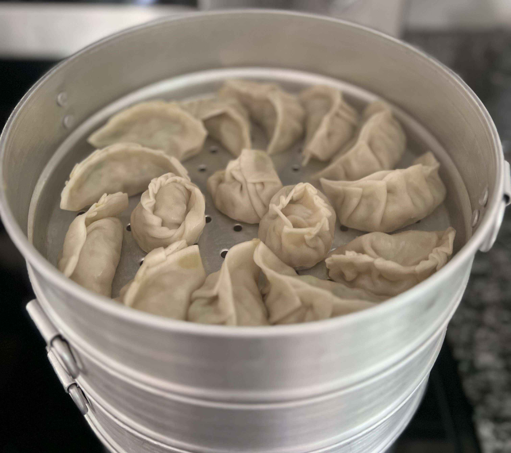
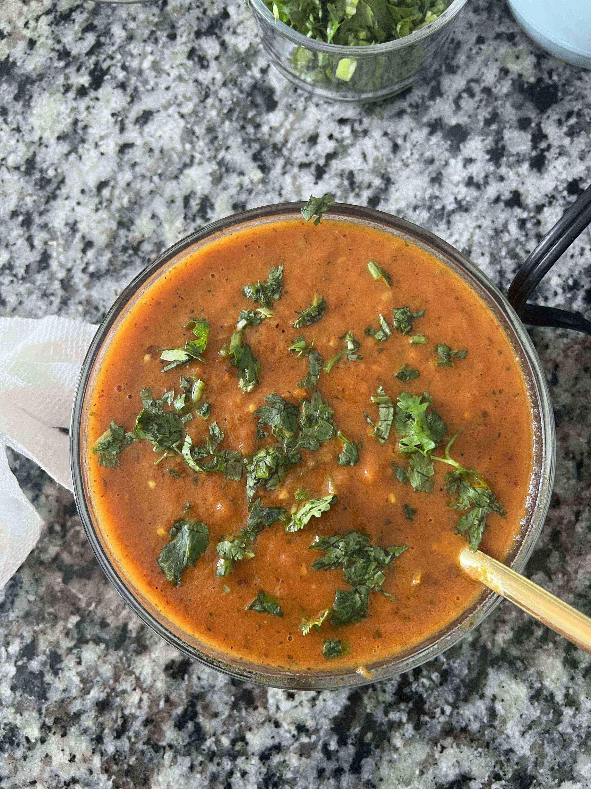
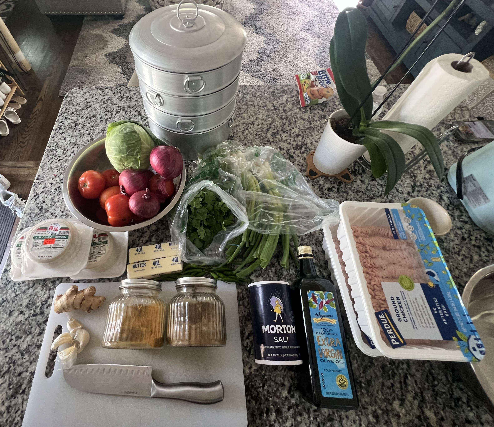

- ### Preparation
- `1/4` cabbage (finely chopped)
- `3` red onions (finely diced)
- `1 handful` of green onions (diced)
- `1 handful` of cilantro (finely chopped)
- `100` dumpling wrappers (2 packs of 50)
- `1.5 sticks` of unsalted butter (melted with microwave)
- `3 cloves` of garlic (minced)
- `3 inches` ginger (minced)
- `2.5 tbsp` salt
- `4 tbsp` meat masala
- `4 tbsp` coriander powder
- `3 lbs` ground meat (chicken)
- `1/4 cup` olive oil

> In a large bowl, vigorously mix the meat, garlic, ginger, masala, coriander, salt, melted butter, cilantro, green onions, olive oil, and onions until it has a consistent texture. Use gloves if necessary.
>
> </img>
>
> </img>
>
> It’s time to wrap the momo! For each momo, put a spoonful of just-mixed filling into a dumpling wrap, and dip the fingers into a bowl of water to close the wrap. Make sure that the table has a small coat of flour to prevent sticking. Watch the video below of how to wrap momo! Place each wrapped momo into a nonstick plate.
>
> <video src="momowrap.MOV" width="100%" controls="" muted=""></video>

---

- ### Steaming
- Steamer pot
- Water

> Fill the bottom layer of the pot with water. Heat to a boil. 
>
> Steam the Momo in the pot for 15-20 minutes. Place in the pot as the following picture.
>
> </img>
> 
> Serve with achaar.

---

- ### Achaar Sauce
- `1` deep non-stick pan
- `5` tomatoes
- `1 handful` serrano pepper
- `1 small handful` chopped cilantro
- `1/4 cup` canola oil
- `1 tsp` turmeric
- `2 tsp` fenugreek seeds
- `2 tbsp` salt

> Wash tomatoes and cut into smaller pieces (four pieces each) 
> 
> Cut the serrano peppers in halves or slit the top.
> 
> Heat a deep pan with canola oil. Once heated, add fenugreek seeds and turmeric powder. Splash water to prevent sticking (it will go boom pop!).
> 
> Add tomatoes while preventing overlap to allow even cooking.
> 
> After cooking for 2 minutes, add serrano pepper to the pan.
> 
> Cook for 3 minutes, add salt to the mix.
> 
> Cook for 20 min or until consistency becomes like a sauce.
>
> </img>

--- 

- ### More Content!

> Here are some more pictures throughout the process of cooking the Momo. It was fun as I hadn't wrapped dumplings in maybe 10 years. It was pretty spicy, but manageable, and was very delicious!! I would definitely make this again but maybe try pork or ground beef. I also want to try pan-frying momo or making soup-filled momo.
> 
> </img> 
> 
> </img>
> 
> </img>

