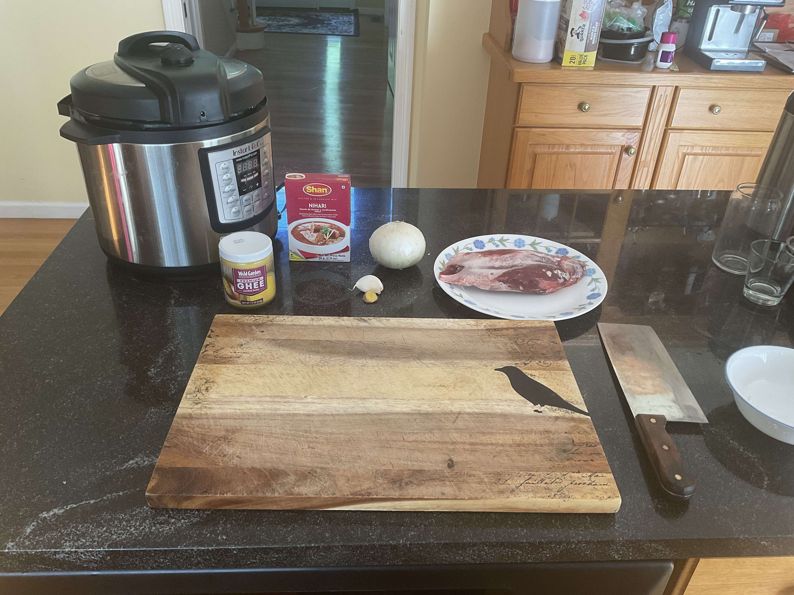
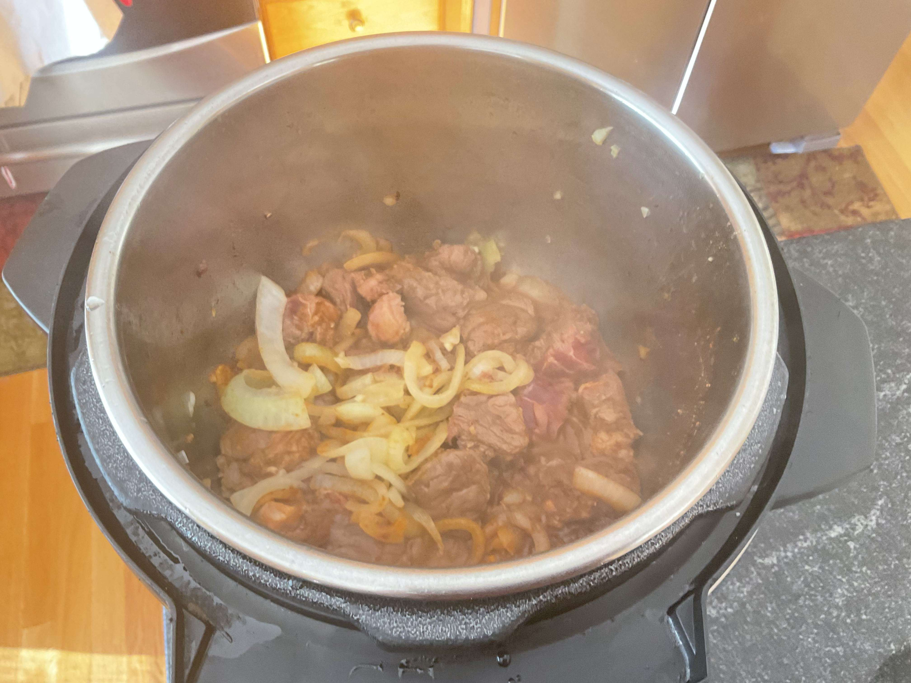

- ### Preparation
- `1` large white onion
- `1/2 in` ginger
- `1 clove` garlic
- `1 lb` beef shank (preferrably with bones, but I didn't use bones and remember to DEFROST OVERNIGHT) 

> Since beef shank isn't usually sold in traditional supermarkets, i had to get it from my grandmother (since it's usually used in Asian dishes)! I also used the Shan Nihari seasoning packet rather than a custom mix since I'm pretty bad at seasoning.
> 
> Dice the white onion into very thin pieces. A food processor should be fine.
>
> Finely mince the ginger and garlic.
>
> Defrost the beef shank overnight in the fridge, then rinse and cut into 1 or 2 inch cubes. If you have bones, cut the meat off the bones and set aside the bones for later.

---

- ### Cooking
- `1/2` cup ghee
- `1/3` packet Nihari seasoning (Shan brand)
- `2` cups water (enough to cover the meat in the pot)
- `1-2 tbsp` corn starch

> Heat the ghee in an Instant Pot on saute mode. Add the onion and saute until caramelized and brown for about 10 minutes. Remove half the onions using a wooden spoon and set them aside. Stir the garlic and ginger into the pot to remove the "freshness" smell. You may need to splash a little water to deglaze the pot.
>
> Add the Nihari seasoning to the pot, splash water to prevent the seasoning from sticking/burning. Then, add the beef shank pieces and stir to coat the meat in the seasoning. Wait until the meat changes color from red to slgihtly brown (2-3 min). Splash water whenever the seasoning sticks to the bottom of the pot.
> 
> Add the removed onions and the water (less if you splashed a lot) and stir to combine. If you have bones, add them now. Close the lid and cook on high pressure for 30 minutes. Let the pressure release naturally.
>
> Serve with Naan or rice. I served it with Naan (from the supermarket) abut I mixed microwave-melted ghee and garlic powder to make this finger-licking garlic butter. Then, I spread it on toasted Naan. Mmmmm so delicious! It was really spicy, so use 1/5 of the Shan packet if you do not want it to be that spicy.

--- 

- ### More Content!

> Watch me roll Pakistan on the country picker!
>
> <video src="nihariwheel.mkv" width="100%" controls></video>
> 
> Credits to @toomanybites (my sister) for the main photo. Here are some more pictures throughout the process of cooking the stew. It was a relatively straightforward and easy process, but deglazing the pot was a hassle at times. It looks really delicious!
> 
> </img> 
> 
> </img>
>
> </img>
