- ### Preparation
- `2` boneless chicken breast (thawed and cut into 2 inch pieces)
- `1 piece` bacalao
- salt
- pepper
- water

> Lightly coat the chicken pieces with salt and pepper. Mix until evenly coated. 
>
> Soak the bacalao piece in cold water for 4 hours, then rinse and set aside.

---

- ### Cooking
- `3 cups` white rice (washed)
- `5.5 cups` broth (from bouillon)
- `1` red onion (diced)
- `1` green bell pepper (diced)
- `4 cloves` garlic (minced)
- `3` roma tomatoes (finely diced)
- `2` bay leaves
- `1/4 cup` extra virgin olive oil
- `1 tsp` smoked paprika
- `4 strands` saffron threads (important)
- `0.5 cup` frozen peas + corn + carrots
- `1 lb` walmart seafood mix (thawed) – (calamari, shrimp, mussels, scallops) 
- `1` lemon (sliced thinly)
- salt
- pepper

> 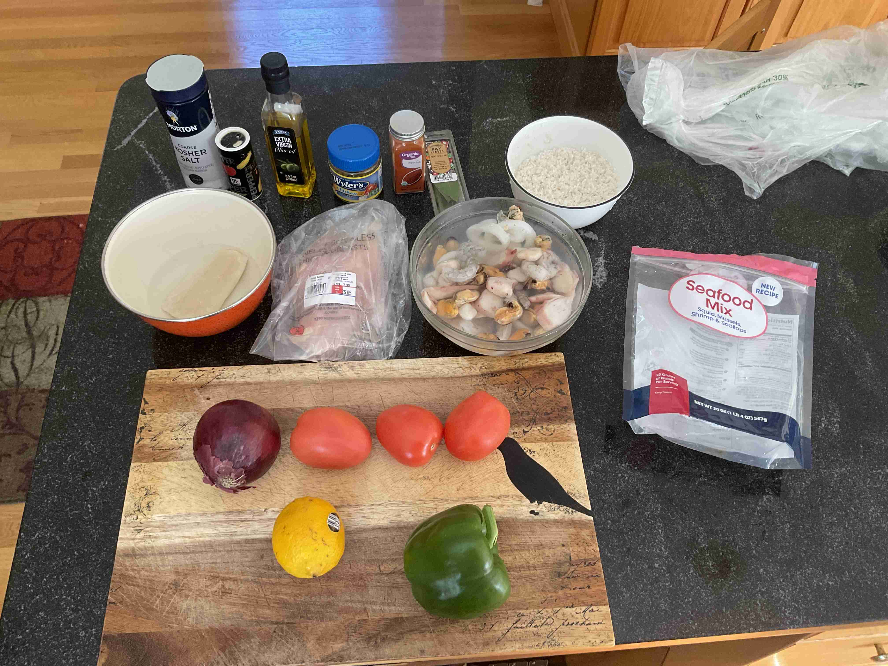</img> 
>
> 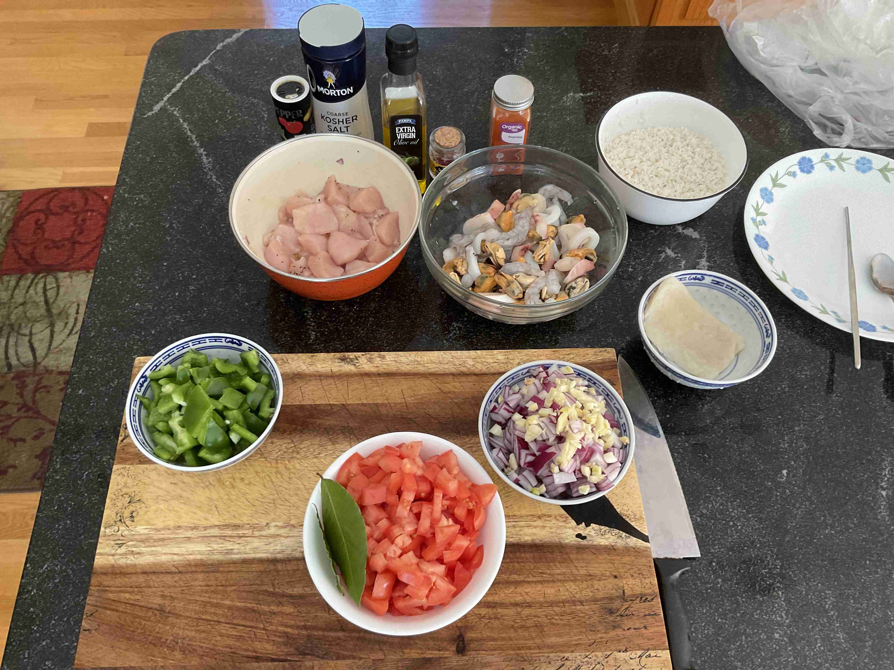</img> 
> 
> Boil 4 cups of water and add 4 bouillon cubes to make 4 cups of chicken broth. Set aside. 
> 
> Boil another cup of water and cook bacalao for 6 minutes, or until soft. Break into pieces in a bowl and set aside.
> 
> Add extra virgin olive oil to a paella pan over medium heat. Add the onion, bell peppers and garlic and cook for 5-10 minutes.
>
> 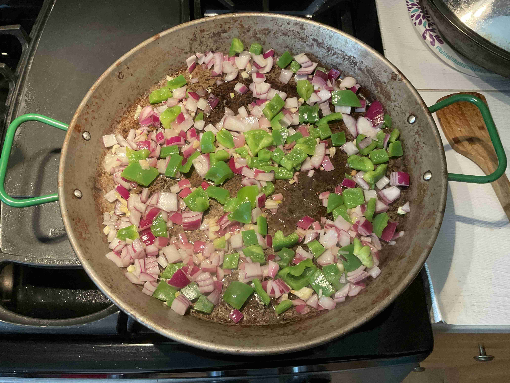</img> 
> 
> Add diced tomatoes, bay leaf, paprika, salt and pepper. Stir occasionally and cook for 10 minutes.
>
> 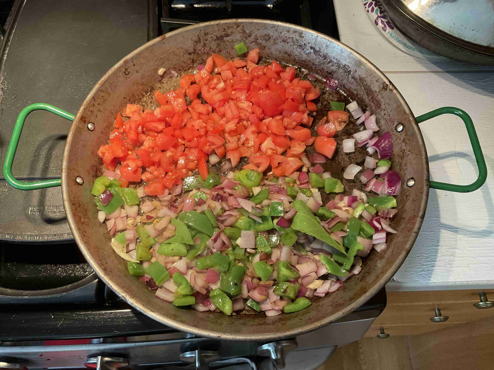</img> 
> 
> Add chicken pieces to sear for 5 minutes over high heat to the pan.
>
> 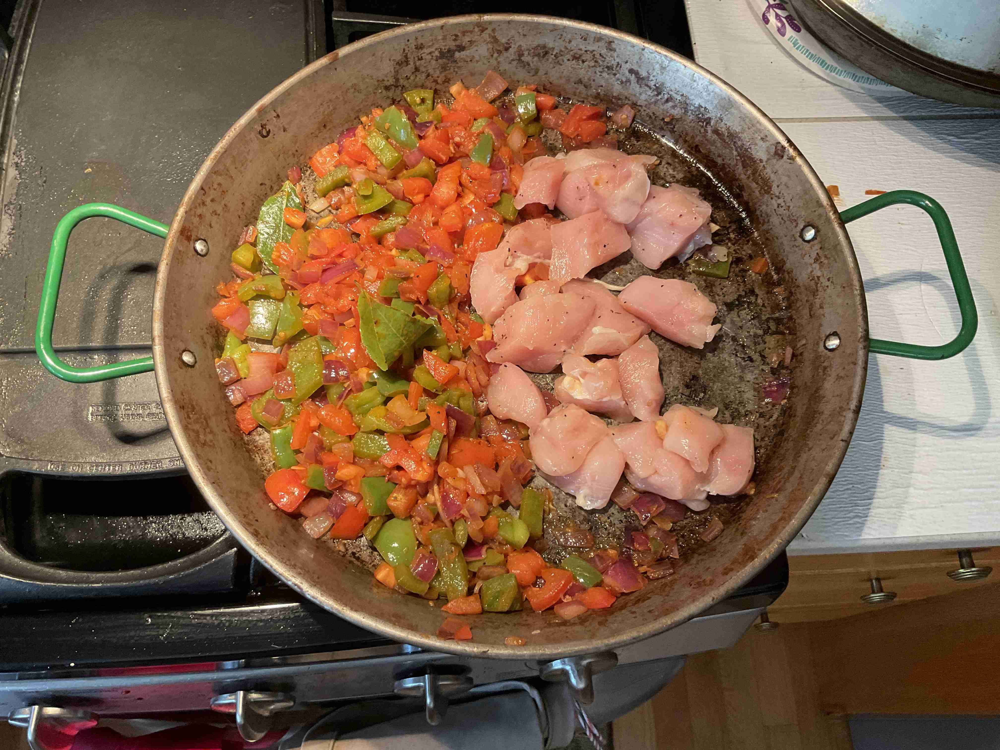</img> 
> 
> Then, stir in the rice for 1 minute and mix together until distributed evenly. Move the mixture to the center.
>
> 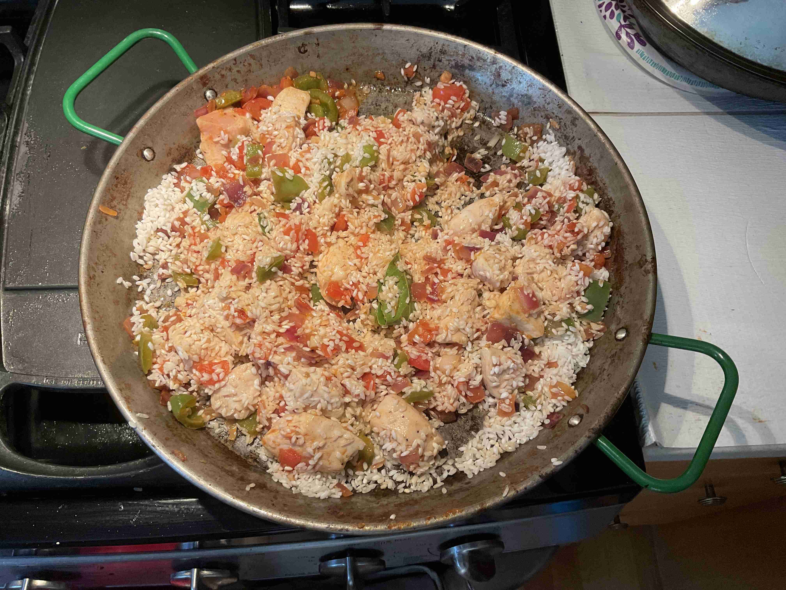</img> 
> 
> Pour the 4 cups of broth slowly all around the center and jiggle the pan to get the rice into an even layer. Flatten the mixture with a spatula. Let simmer for 5 minutes, then add the remaining 1.5 cups of broth. Continue to cook until broth is almost completely absorbed and rice is cooked (15-18 minutes). 
>
> 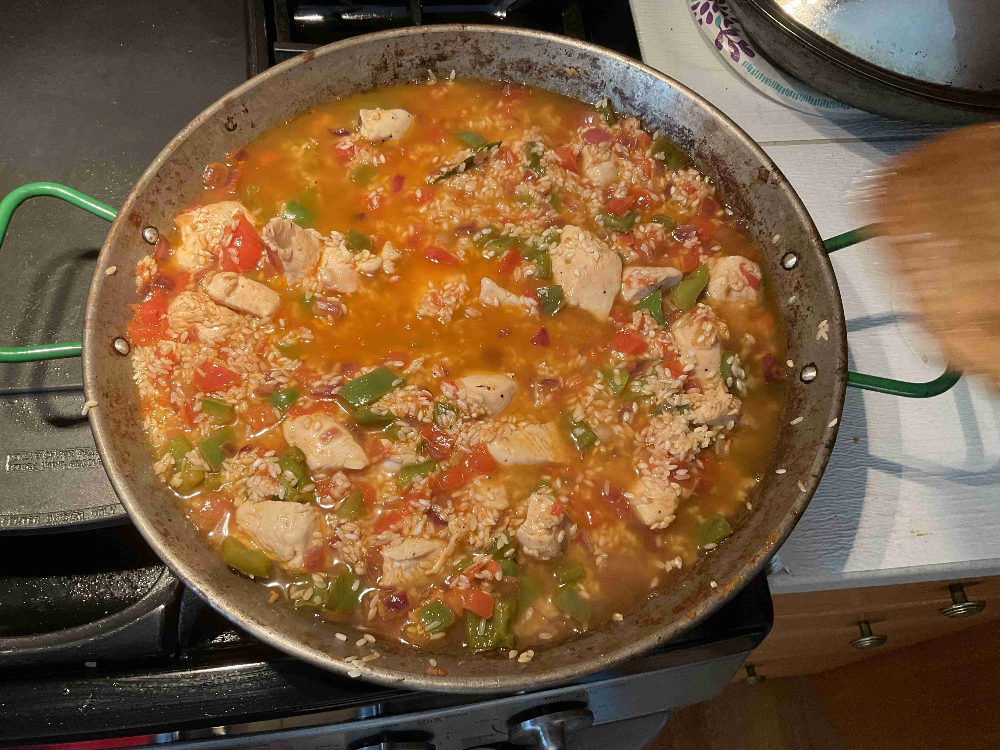</img> 
> 
> > > Do not stir the mixture going forward!
>
> 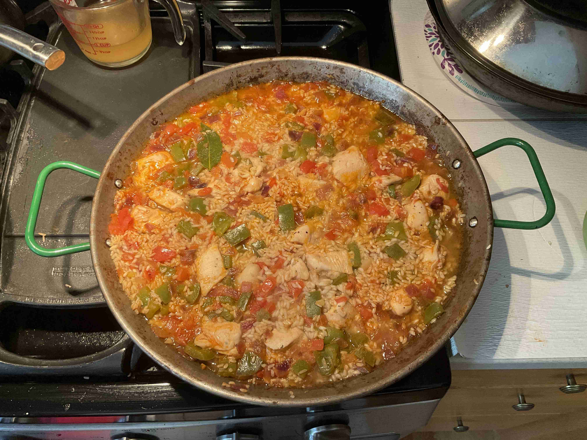</img> 
> 
> Nestle in the seafood mix into the rice. Sprinkle frozen peas and shredded bacalao on top. Cook until broth is completely absorbed.
>
> 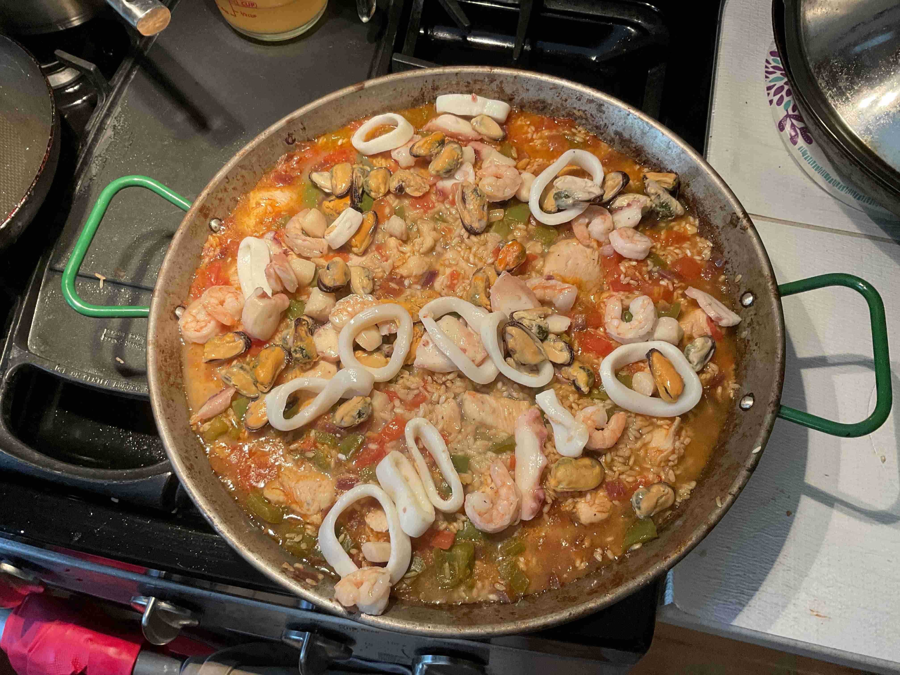</img> 
>
> 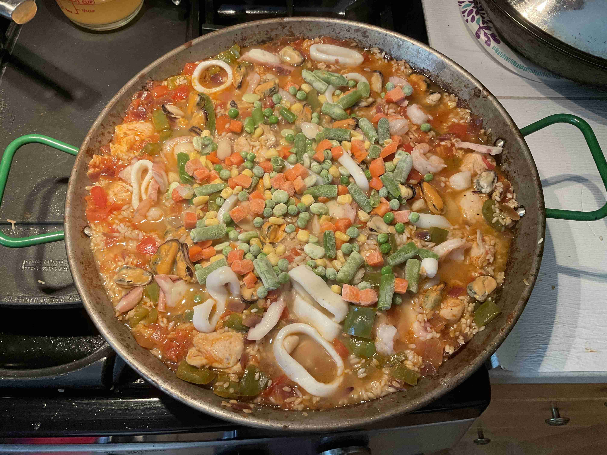</img> 
>
> 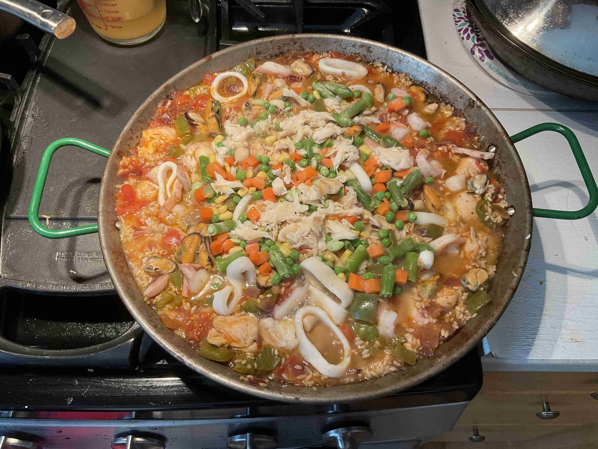</img> 
>
> Once completely cooked, nestle lemon slices in the center in a circle. Let cool for 5-10 minutes.
>
> 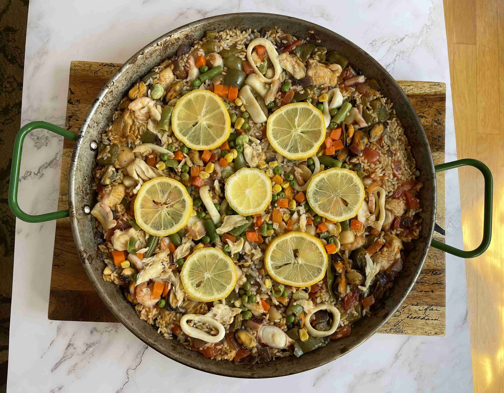</img> 
> 
> Juice half of the lemon over the rice, then cover with tinfoil and let rest off the heat for 10 minutes. Serve and enjoy while hot!
>
> 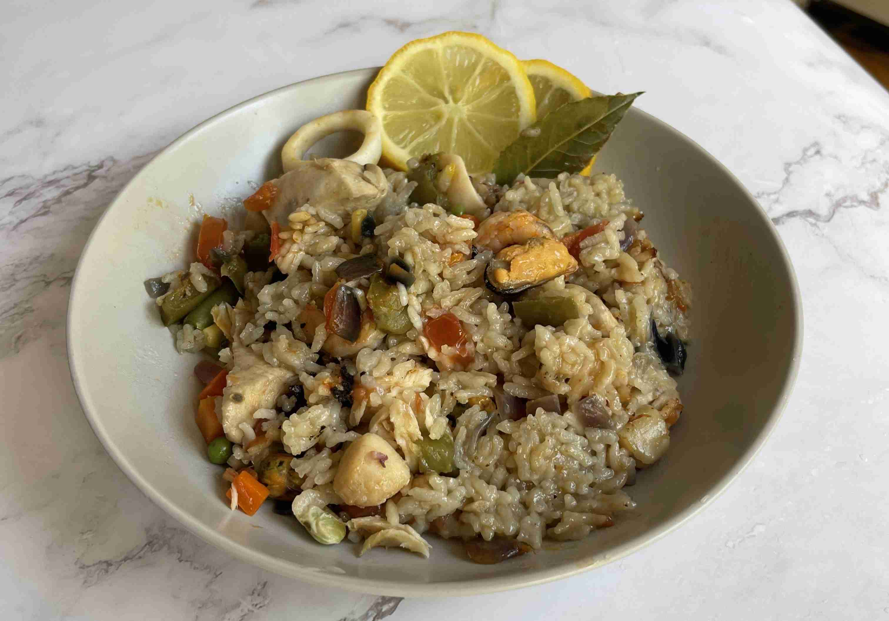</img> 
