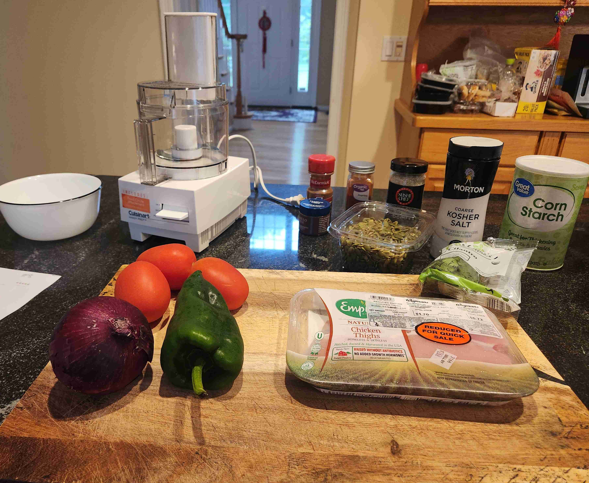
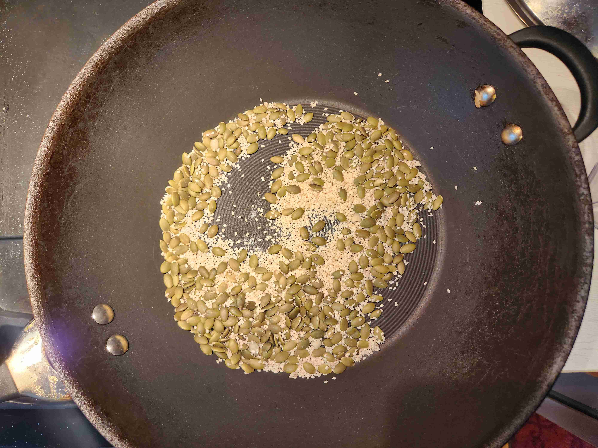
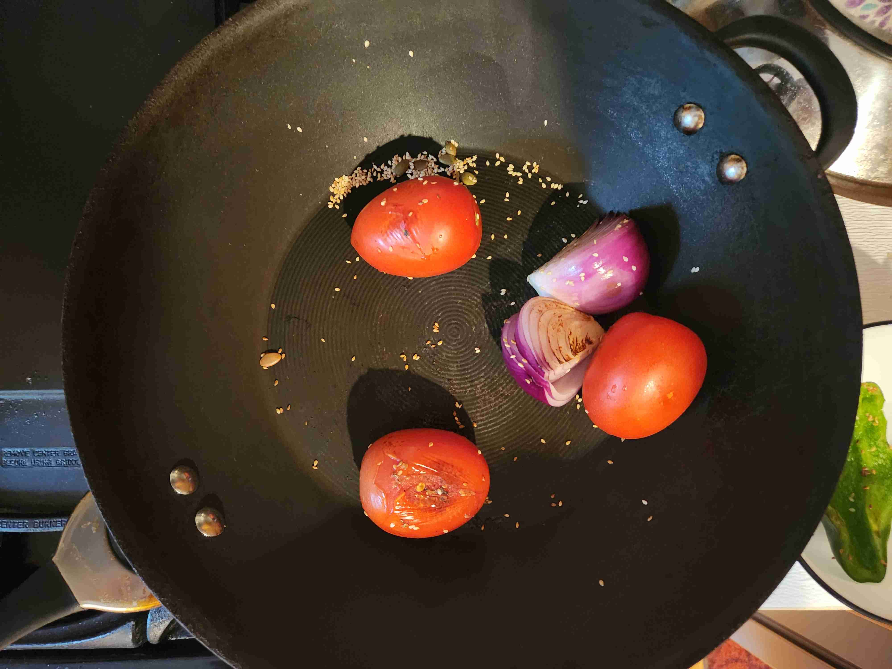
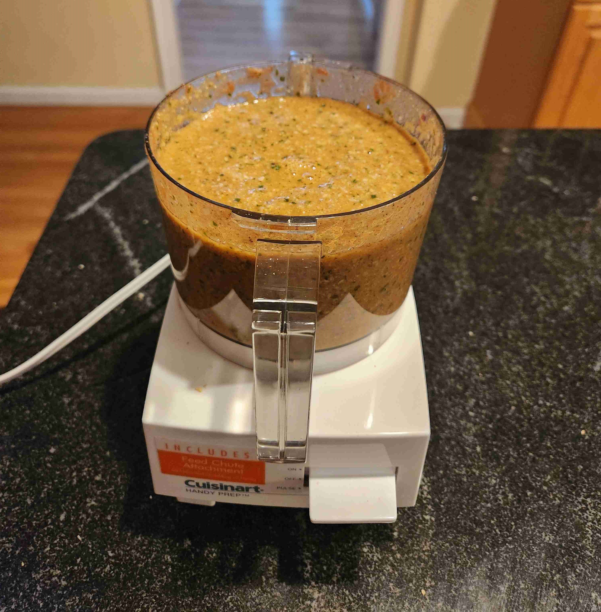
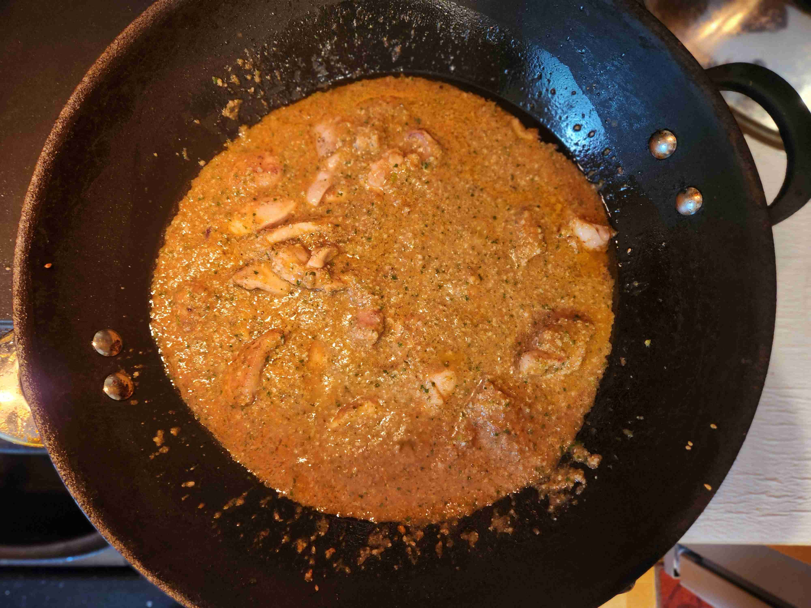
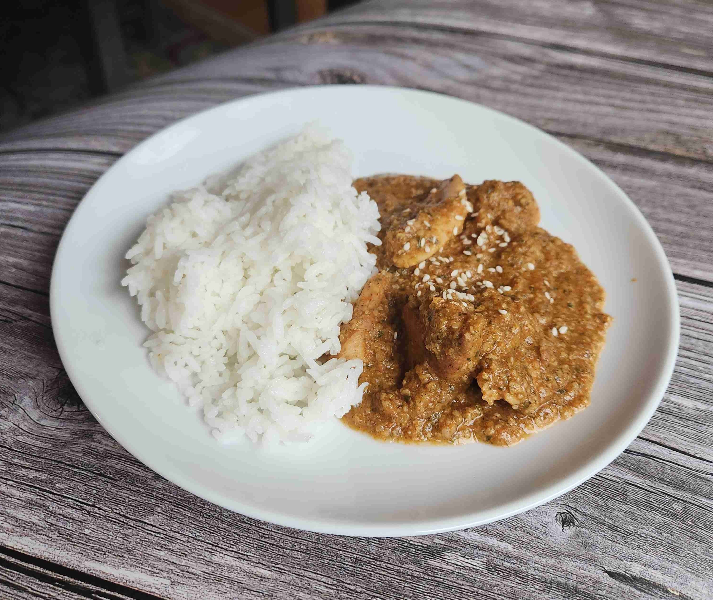
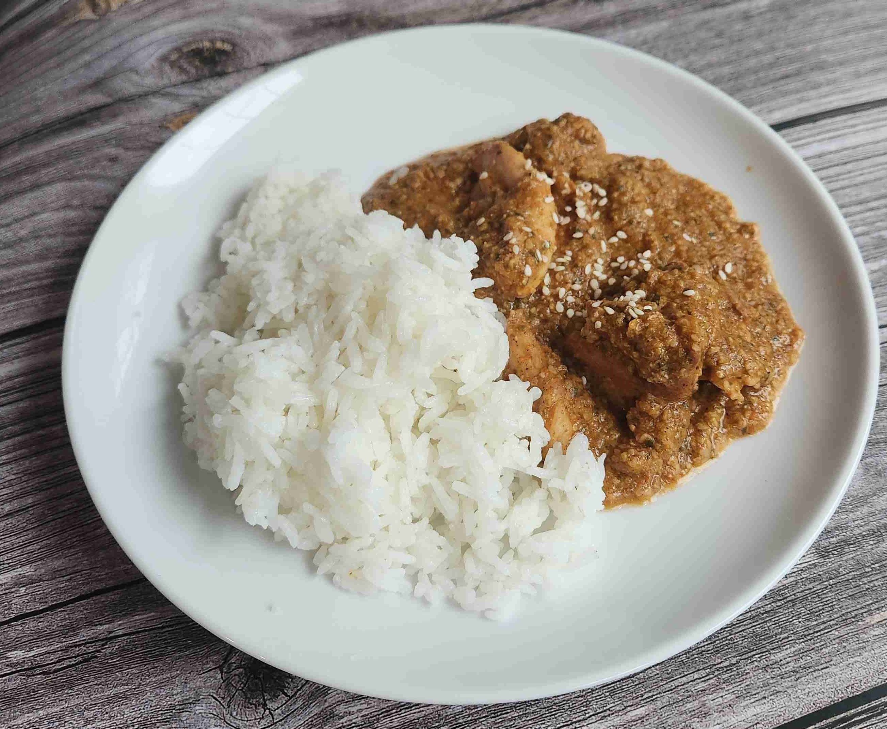

- ### Cooking
- `1 lb` chicken thigh (cut into bite-sized pieces)
- `1 tbsp` kosher salt
- `0.25 cup` pumpkin seeds (pepitas, untoasted and shelled)
- `0.25 cup` sesame seeds (untoasted)
- `0.5` tsp ground cinnamon
- `1 tsp` corn starch
- `3` roma tomatoes
- `0.5` red onion
- `0.5` chile poblano (or pasilla)
- `0.5 tsp` chile guajillo powder
- `0.25 tsp` paprika
- `0.25 cup` cilantro (chopped)
- `2 tsp` vegetable oil
- `1 cube` chicken bouillon
- `1` food processor

> </img> 
> 
> In a wok, add oil and head on medium heat. Then, add the chicken and salt and cook until browned, about 5 minutes. Remove the chicken from the wok and set aside.
>
> </img> 
>
> In a pot on the side, boil 1 cup of water and mix in the chicken bouillon. Stir until the bouillon is dissolved, then set aside.
>
> After the chicken is cooked, toast the pumpkin seeds and sesame seeds in the wok for 10 minutes or until brown on each side. Put the seeds all into the food processor, pulse until finely ground. Remove from the processor.
>
> </img> 
>
> Add the roma tomatoes, onion, and chile poblano to the wok and char until browned, about 5 minutes. Remove from the wok and put into the food processor with the cilantro. Pulse until becomes a sauce.
>
> </img> 
>
> > > Make sure not to move the vegetables around too much, as you want them to char.
>
> Add ground cinnamon, paprika, seed mixture, and corn starch into the food processor. Pulse until everything is combined. 
>
> <video src="pepiandepollovegemix.mp4" width="100%" controls muted=""></video>
>
> <video src="pepiandepolloseeds.mp4" width="100%" controls muted=""></video>
>
> Add 1 cup of the chicken broth from the bouillon cubes and add to the food processor. Pulse again until everything is mixed.
>
> </img> 
>
> Pour the sauce into the wok with the chicken and simmer without a lid for 10 minutes, stirring occasionally. Serve hot with rice and sesame seeds of your choice. Enjoy!
>
> </img> 

---

- ### Changes Made to Recipe

> Firstly, rather than boiling the chicken and making broth that way, I decided to cook the chicken in a pan to get a better texture and make a richer chicken broth using bouillon cubes. Definitely a better option because boiled chicken just doesn't taste good!
>
> Second, I could not find dried guajillo or pasilla peppers, but I did find guajillo powder and poblano peppers, which are very similar substitutes. It still came out very well, so it was an okay substitute.
>
> Lastly, I cut down on the chicken broth as I realized that the whole mixture was not going to fit in my small food processor (Which started leaking at one point). So, I cut down on the broth to make the sauce less watery and worked very well.
>
> </img> 
>
> </img> 