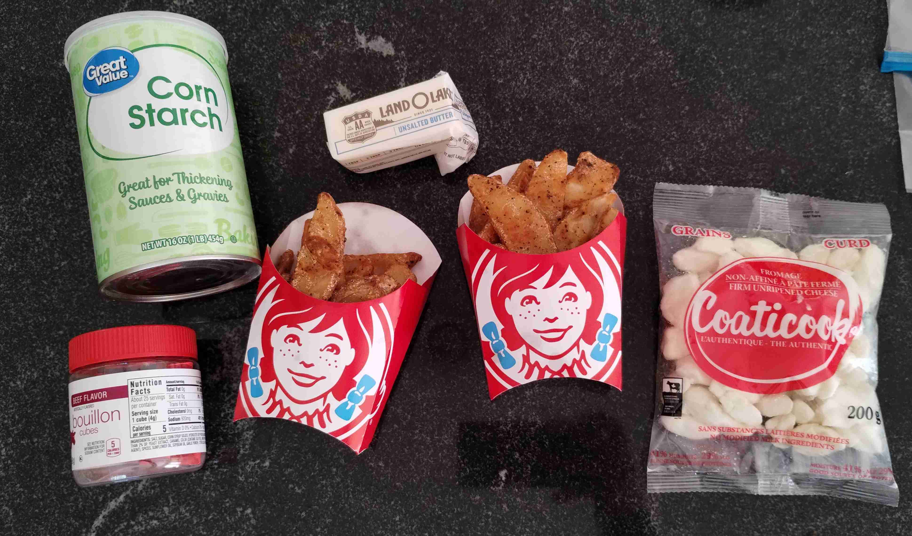
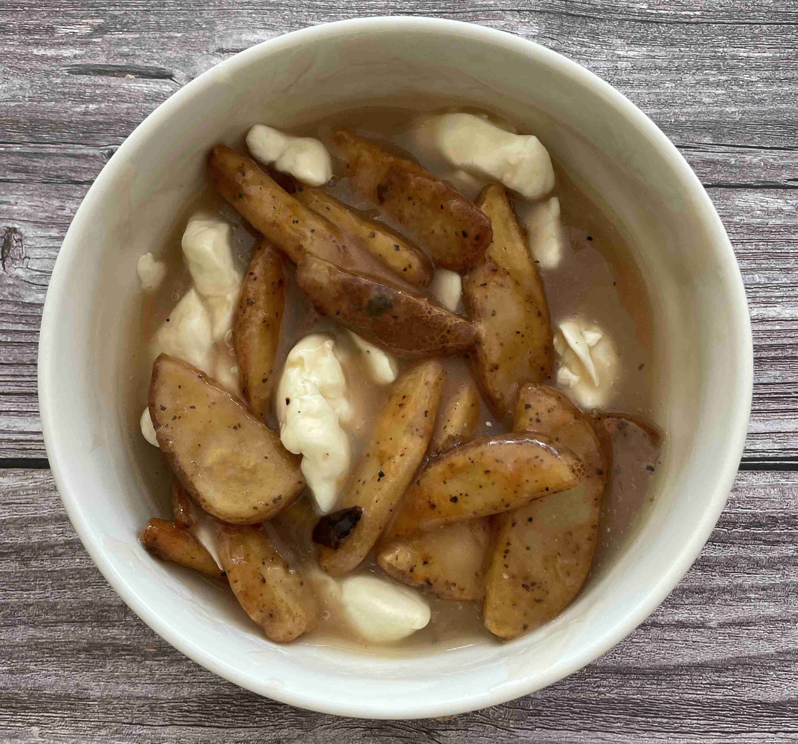
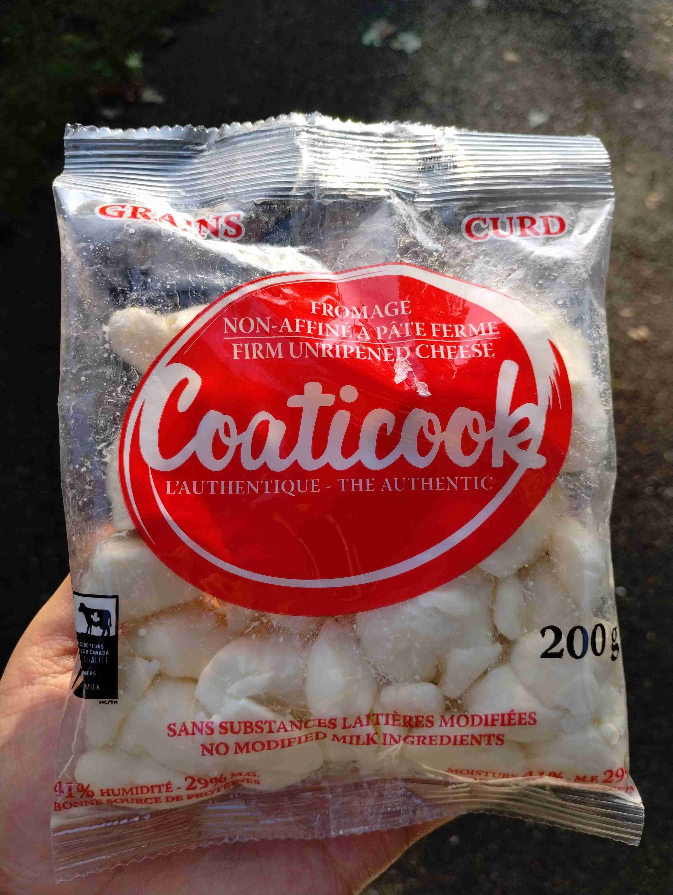

- ### Cooking
- `4 tbsp` butter
- `3 tbsp` corn starch
- `1/2 cup` water for corn starch
- `3` beef bouillon cubes
- `2 cups` water for bouillon cubes
- `2 cups` cheese curds (I used a Canadian brand)
- `2` large Wendys breakfast fries

> </img>
> 
> Heat 2 cups water to boiling and mix in the bouillon cubes. Set aside.
>
> In another pot, melt the butter. Mix corn starch into cold water in a separate cup, and slowly pour into the pot. Add the beef stock from the other pot and stir until it thickens.
>
> Let simmer for 8-10 minutes while stirring every minute or so. Salt and pepper to taste.
>
> </img>
>
> Drizle the gravy onto the fries and top with cheese curds. Mix in and enjoy while hot!
>
> </img>

---

- ### More Content

> Check out these cheese curds straight from Canada, courtesy to Ms. Julie!! Thanks Ms. Julie!!!
>
> </img>
>
> Update: I made this again with Five Guys fries (ordered extra crispy) and it was amazing! The fries were so crispy and salty, and the gravy was so flavorful. Ms. Julie brought an even larger bag of cheese curds and it would so delicious. She showed me how to make a roux in an Instant Pot and showed me how she made her gravy. I thought it was a bit too black peppery but is definitely a grown taste. I would also recommend using real beef stock instead of bouillon cubes, as it would make the gravy more flavorful. A quick an easy recipe for on the go!
