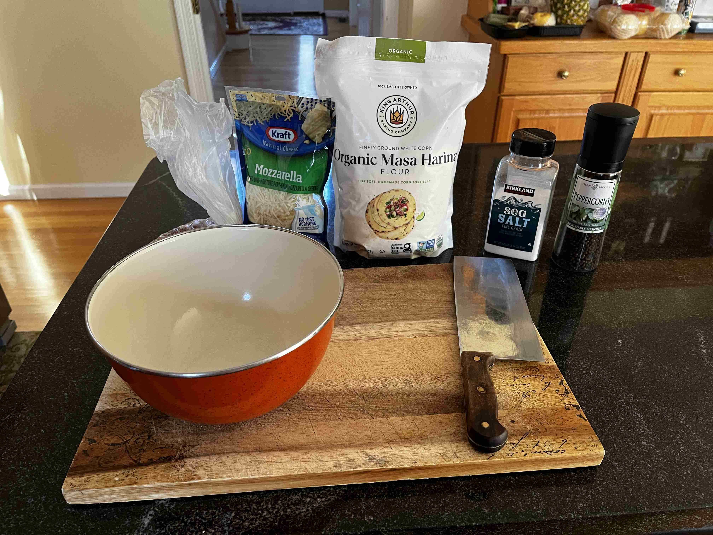
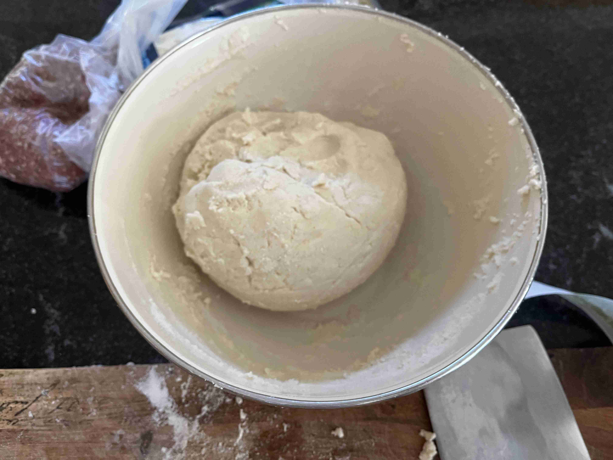
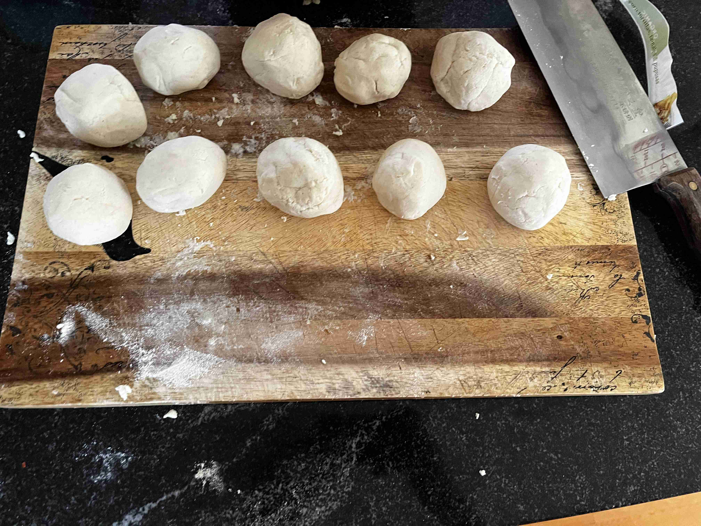
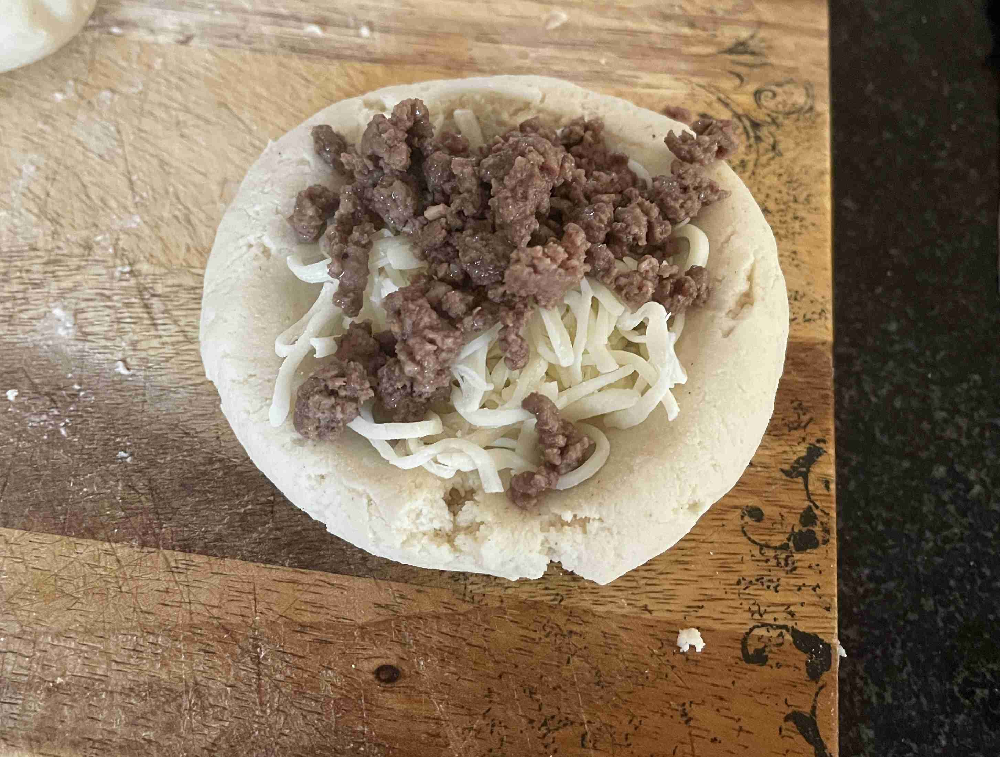
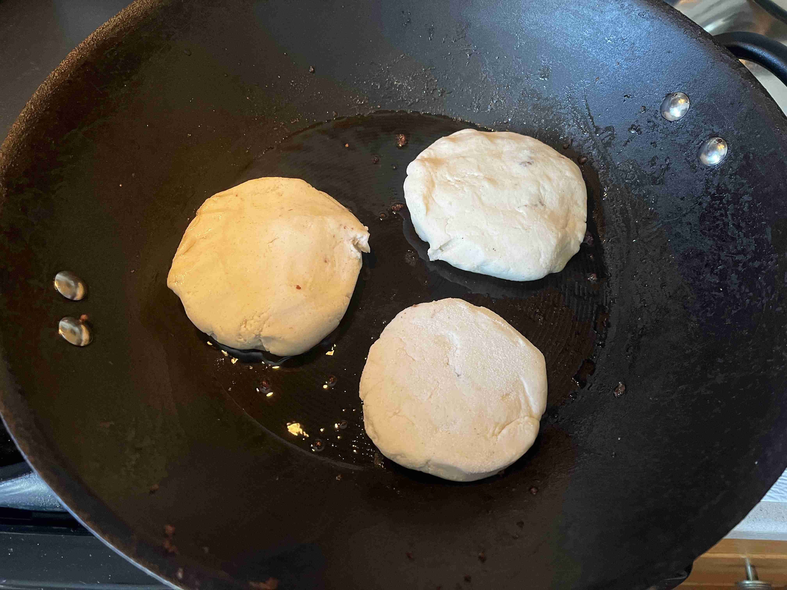
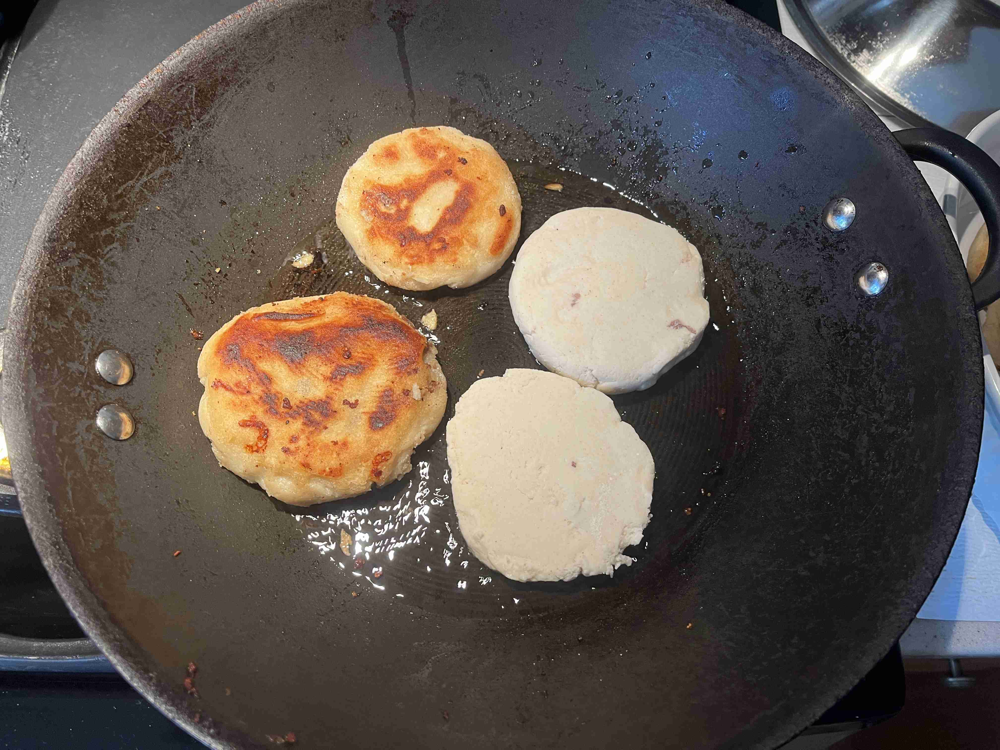

- ### Cooking
- `1 lb` lean ground beef (season with onion/garlic powder, salt, pepper, and any other seasoning you wish)
- `6 cups` masa harina
- `5.5 cups` water
- `8 tbsp` fine grain sea salt
- `3 cups` shredded mozarrella cheese or mexican cheese blend
- `1/2 cup` vegetable oil (for cooking)

> </img>
>
> </img>
> 
> Mix in salt and flour in a large mixing bowl with a fork. Add water and mix with hands until dough forms. Knead dough for 5 minutes.
>
> Once the dough becomes like a dry playdough, cover with a damp towel and let rest for 10 minutes.
>
> Cook ground beef in a skillet until brown. Season with salt, pepper, and any other seasoning as you wish.
>
> Split the dough into around 15 2-inch balls. Make a well in each and fill with 1 tbsp of cheese and 1 tbsp of ground beef. Close the dough around the filling and flatten into a 1/4 inch thick disk.
>
> </img>
>
> </img>
>
> Heat oil in a large skillet. In batches, cook the pupusas for 5-6 minutes on each side, or until a darker brown. Serve with salsa. Enjoy!   
>
> </img>
> 
> </img>
>
> Reflecting on this recipe, as I went through the cooking process, I gradually made the Pupusa's flatter as I went on as the thicker ones weren't well cooked inside. So, I would recommend making the balls as round as possible then flatten it as flat as possible. Then, you can patch up any weak points. Lastly, I think a better mexican blend or specialty cheeses would have enhanced the flavor and using beef birria would have been a great addition to the pupusa as a dip or for the filling.
