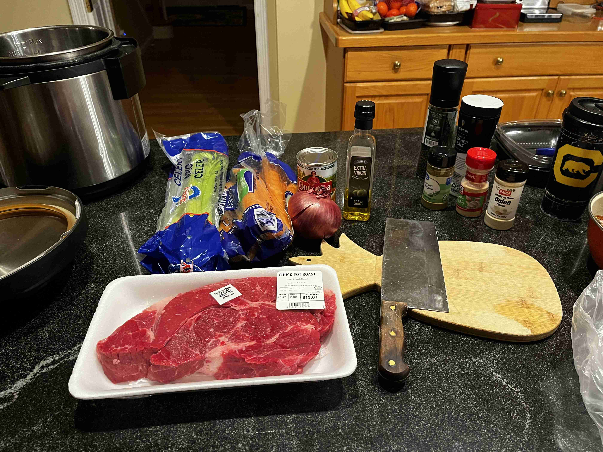
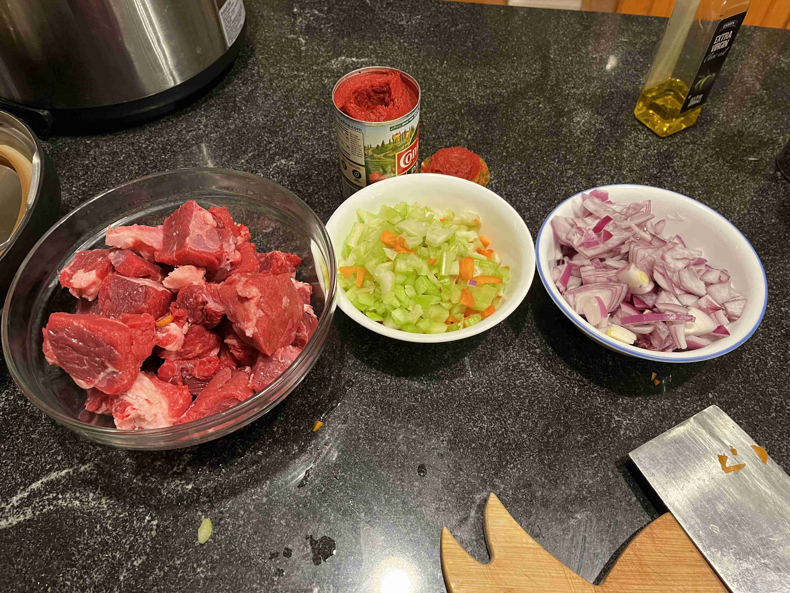
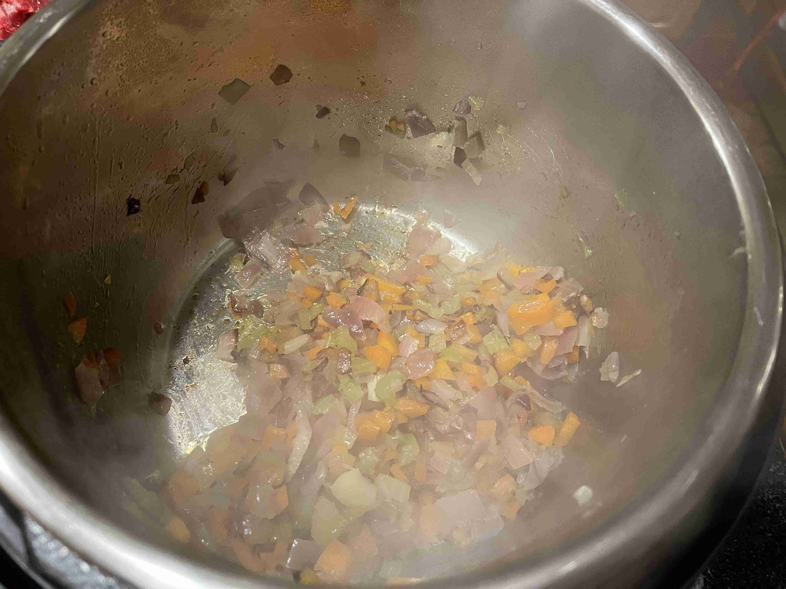
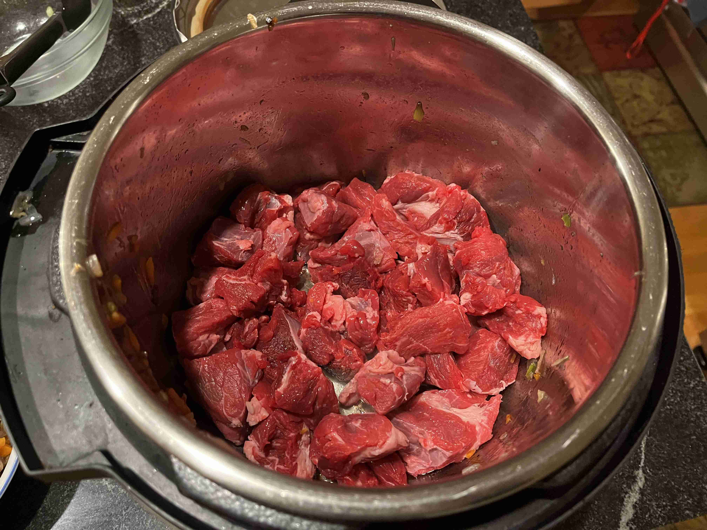
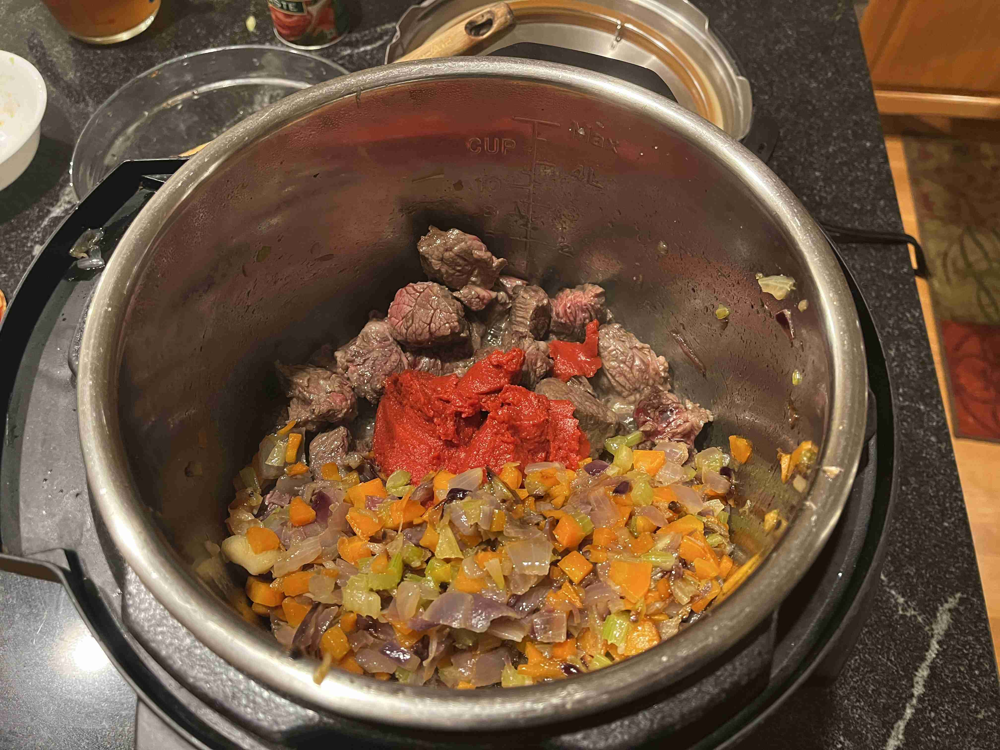
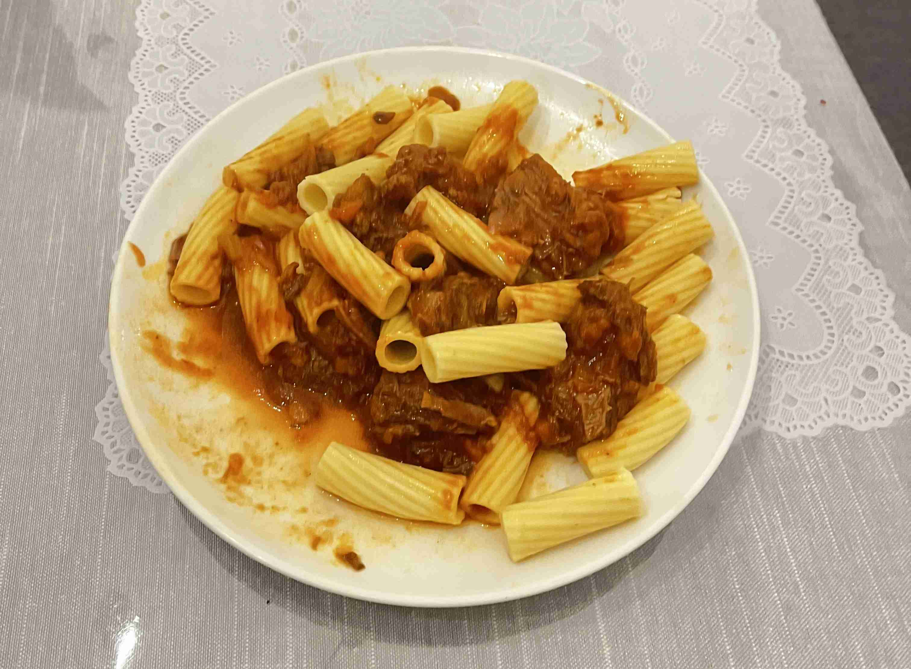
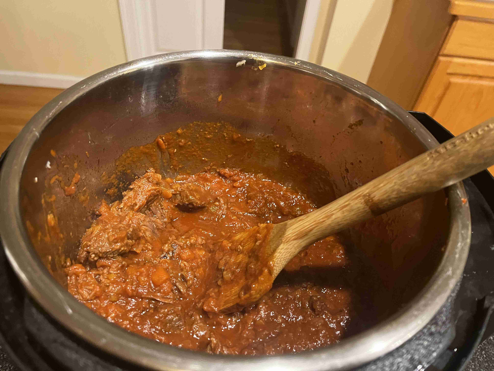

- ### Cooking
- `1` large purple onion (minced)
-  `1` carrot (minced)
-  `2 stalks` celery (minced)
- `1 tsp` garlic powder
- `1/2 cup` extra virgin olive oil 
- `2 lbs` chuck roast (sliced into 1.5in cubes)
- `1 tbsp` garlic powder
- `0.5 tbsp` onion powder
- `0.25 tbsp` oregano
- `3/4 cup` tomato paste
- `1.25 cup` beef broth
- `0.5 cup` red wine
- salt and pepper

> </img>
>
> </img>
> 
> To make a soffrito, add 1/2 cup of the EVOO into an Instant Pot on saute mode. Add the onion, carrot, celery, and 1/2 tbsp garlic powder. Cook for 15 minutes fully covered in olive oil until the vegetables are essentially caramelized. Take out and set aside.
>
> </img>
>
> </img>
>
>  Sear the beef until browned on all sides. 
>
> </img>
>
> Add the tomato paste, garlic powder, onion powder, oregano, broth, red wine, over the mix. Add the soffrito back in.
>
> </img>
>
> Pressure cook for 35 minutes. Let the pressure release naturally.
>
> Break apart the beef with a wooden spoon. Season with salt and pepper. Serve over pasta or in lasagna. Enjoy!
>
> </img>
>
> </img>

