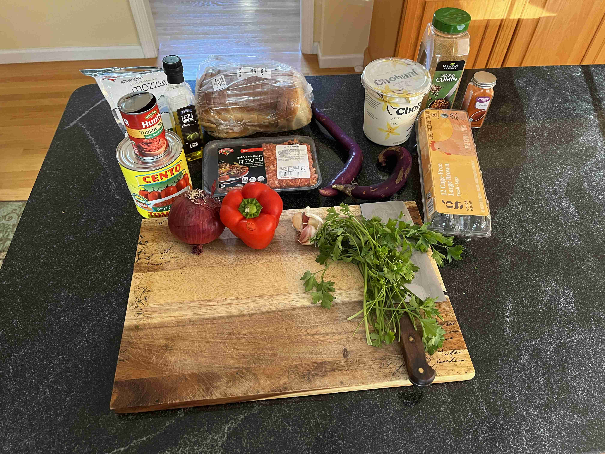
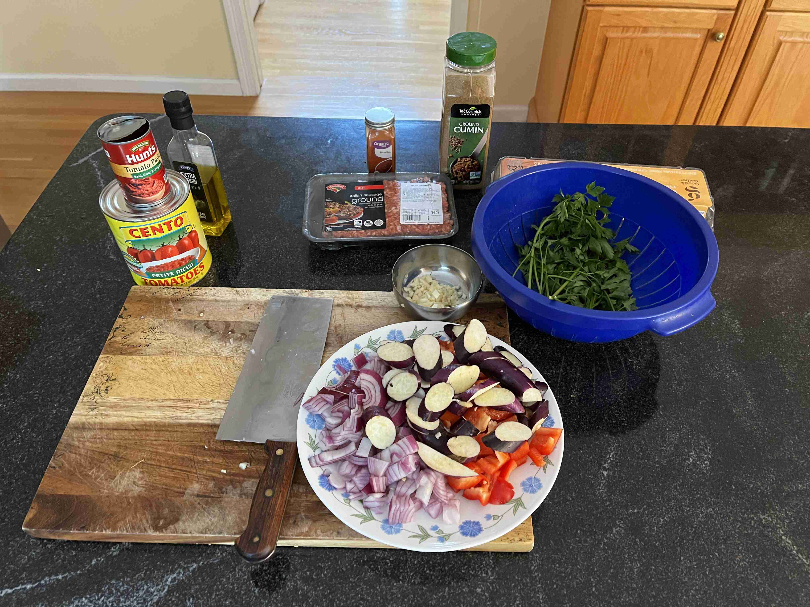
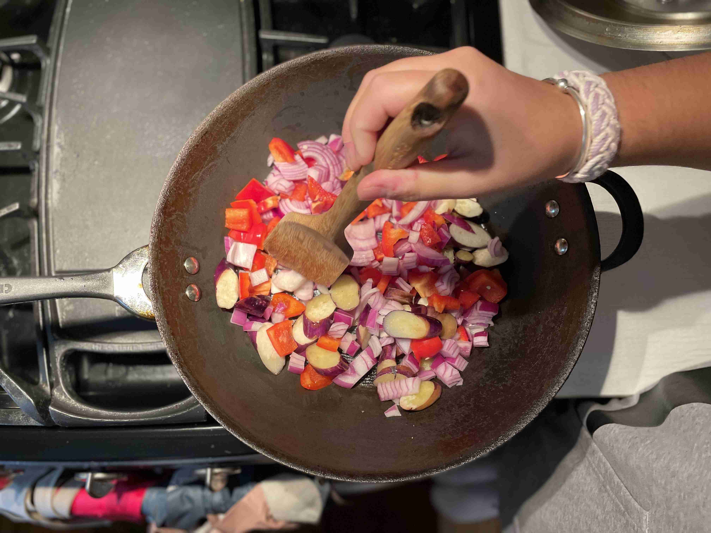
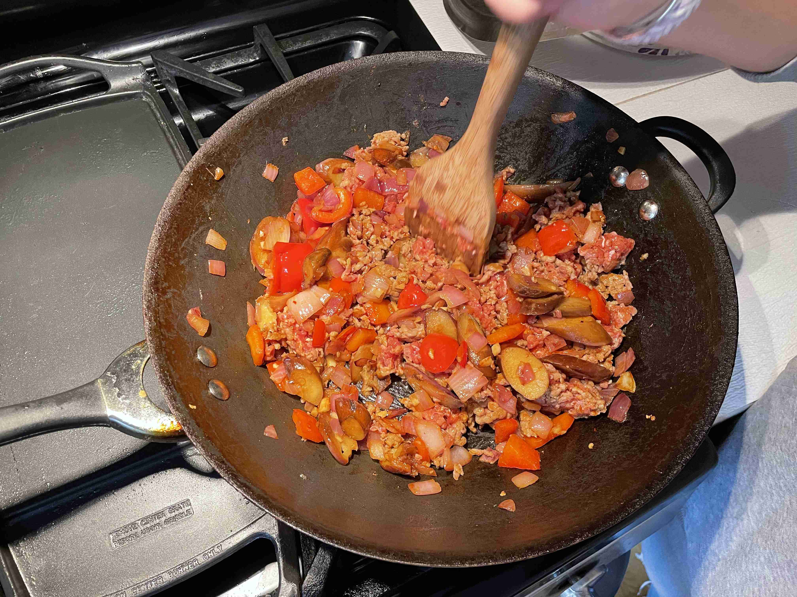
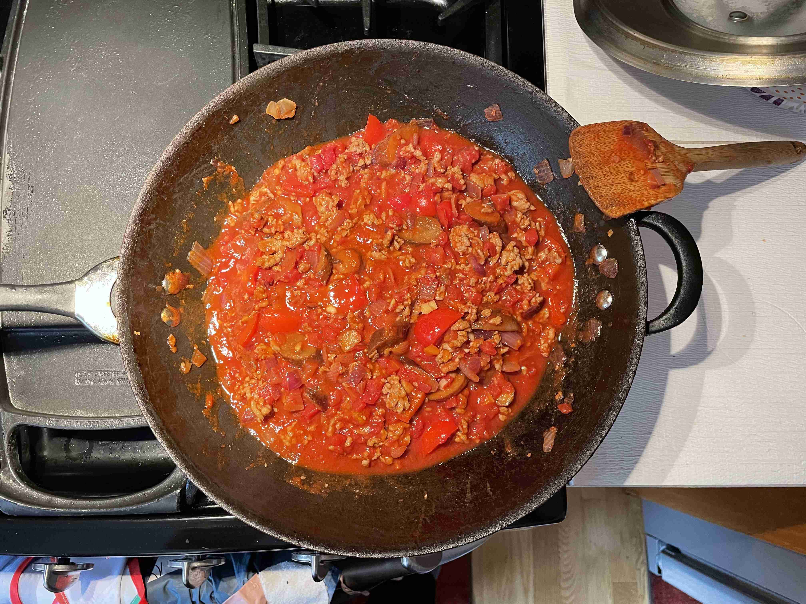
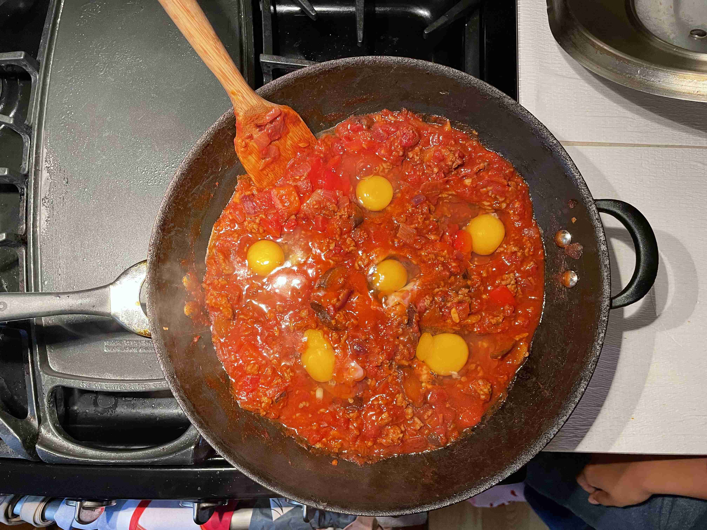
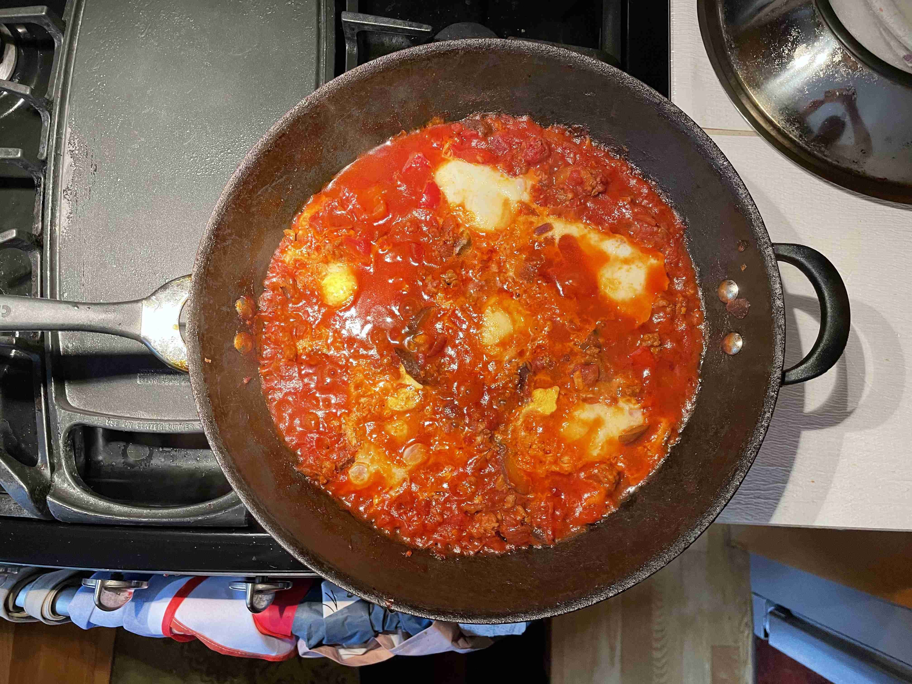

- ### Cooking
- `2 tbsp` olive oil
- `1 lb` ground italian sausage
- `1` medium onion (diced)
- `1` red bell pepper (diced)
- `2` eggplants (sliced)
- `4 cloves` garlic (minced)
- `2 tsp` paprika
- `1 tsp` cumin
- `28 oz can` whole peeled tomatoes
- `6` large eggs (or as many can fit)
- `1 bunch` parsley (chopped)
- `2 tsp` salt
- `2 tsp` pepper
- `1/4 cup` feta cheese (crumbled)

> </img>
>
> </img>
> 
> Heat olieve oil in large skillet over medium heat. Add bell pepper, onion, and eggplant and cook for 5-6 minutes. Sprinkle with salt.
>
> </img>
>
> Add ground italian sausage and garlic and cook until meat is browned.
>
> </img>
>
> Add paprika, cumin, salt and pepper and cook for 1 minute.
>
> Pour in can of tomatoes and break with spatula. Season wtih salt and pepper and bring to a simmer.
>
> </img>
>
> Make wells with a spatula. Crack eggs into wells and cover with lid. Cook for 5-8 minutes, or until eggs are cooked to your liking.
>
> </img>
>
> </img>
>
> Garnish with parsley and serve while hot with toasted bread (pita/sourdough), pasta, or some other grain for a hearty brunch!
>
> Thanks to my friends for cooking this with me!

