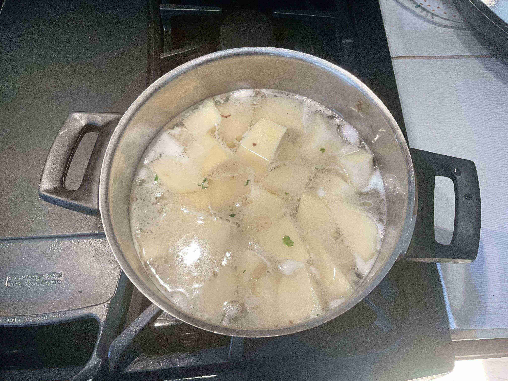
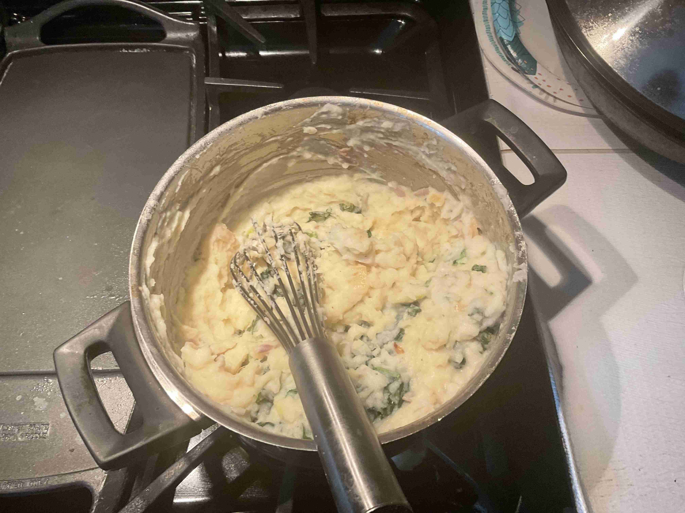

- ### Preparation
- `3 lb` russet potatoes
- `1 handful` kale
- `2 cloves` garlic
- `2` shallots
- `1 lb` kielbasa sausage (or Dutch rookworst)

> Skin and dice the potatoes into 1 inch cubes. Set aside.
> 
>  Finely mince the garlic and shallots and place them in a bowl. 
> 
> Remove the kale leaves from the stems and chop into inch sized pieces. 
> 
> Slice the kielbasa sausage into pieces. Set aside.

---

- ### Cooking
- `2 tbsp` butter for cooking kale
- `4 tbsp` butter for mashed potatoes
- `1 cup` half and half
- `1` pinch of ground cinnamon
- salt and pepper
- `1/4 cup` water

> Surprisingly, this was my first time making mashed potatoes!
> 
> Add potatoes to a large pot, fill with cold water untill potatoes are covered, and salt the water like the ocean! Bring to a boil and cook for 20 minutes, then drain the water.
>
> While the potatoes are cooking, heat 2 tbsp of butter in a pan on medium heat. Add the garlic and shallots and cook for 2 minutes. Add the kale and 1/4 cup water and steam with a lid for 5 minutes, until the kale is wilted. Set aside.
>
> After draining the potato water, mash with butter, milk, salt, pepper, and ground cinnamon. Once smooth, stir in the kale mixture.
>
> In the meantime, saute the kielbasa sausage in a pan until browned.
>
> Serve with the mashed potato on the bottom and sausage laid ontop. Enjoy!

--- 

- ### More Content!

> Watch me roll the Netherlands on the country picker!
>
> <video src="stamppotwheel.mkv" width="100%" controls muted=""></video>
> 
> Credits to @toomanybites (my sister) for the main photo. Here are some more pictures throughout the process of cooking the stew. It was a very straightforward and easy process.
> 
> Ingredients!
> 
> </img> 
>
> Cooking the mashed potatoes!
> </img>
>
> Cooking the sausage!
> 
> </img>
>
> Mixing the mashed potatoes!
> 
> </img>
>
> Final product!!
> 
> </img>