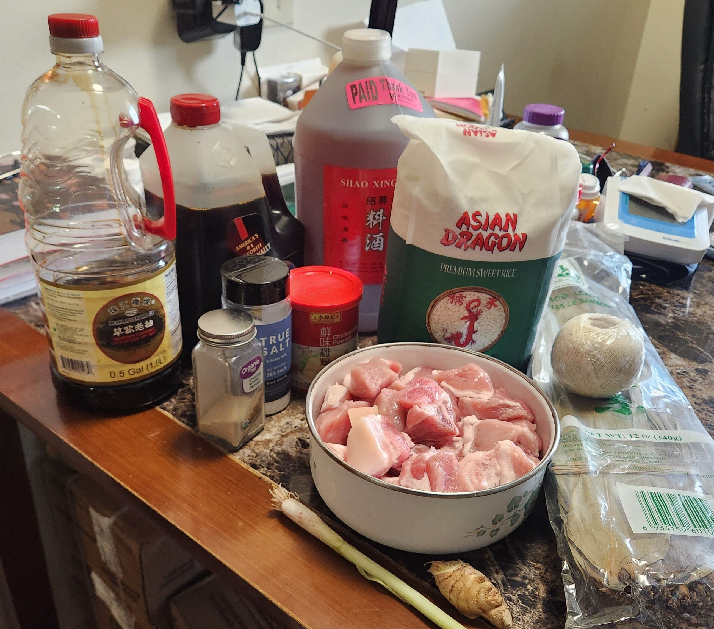
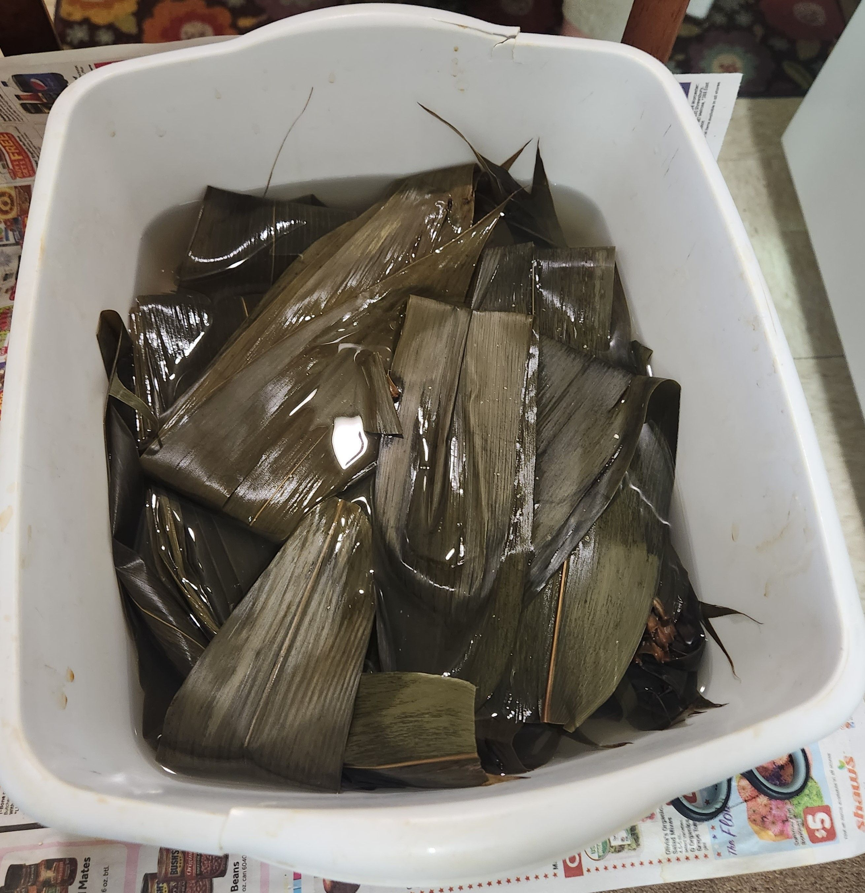
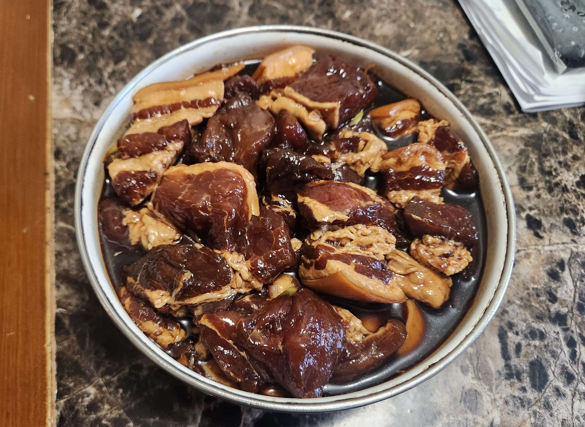

- ### Preparation (Meat)
- `X` stuff

> 
---

- ### Wrapping
- `X` blah

> Fill the bottom layer of the pot with water. Heat to a boil. 

---

- ### Steaming
- `X` stuff

> Wash tomatoes and cut into smaller pieces (four pieces each) 

--- 

- ### More Content!

> blah
> 
> </img> 
> 
> </img>
> 
> </img>

