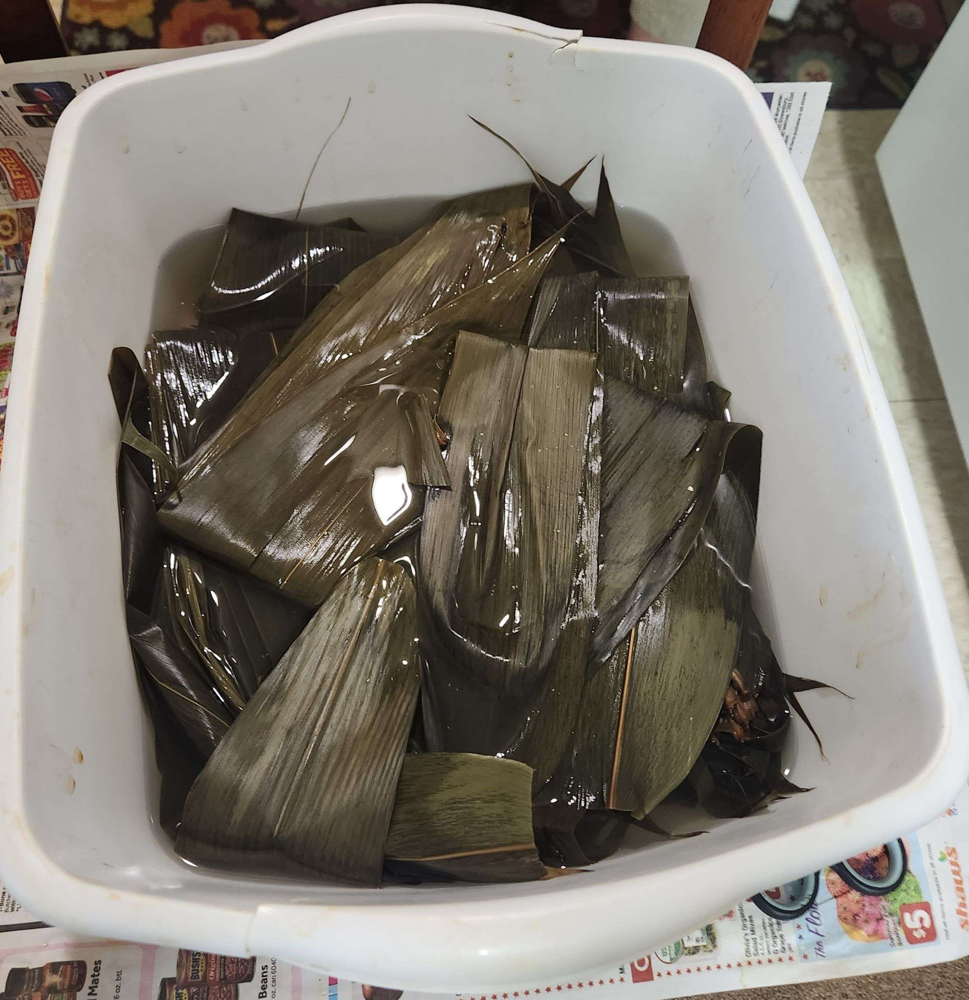
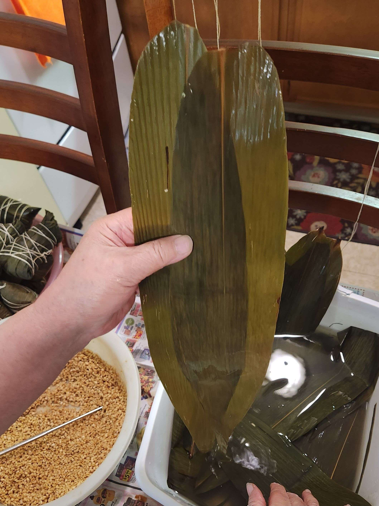

- ### Prep (Day Before)
- `60` bamboo leaves
- `2.5 lb` pork belly (cut into 1 inch squares)
  

> Soak the bamboo leaves in cold water overnight.
> 
> Then, wash the bamboo leaves in hot water the following day.
> 
> Boil the leaves for around 10 minutes, or until soft. 
> 
> > > ***If there are any extra leaves, it can be used another time (but must be boiled soft again).***
>
> </img>

---

- ### Marinating (Day Before)
- `8 in` green onion (cut into small pieces)
- `2 in` ginger (cut into thin slices)
- `2 tsp` salt
- `1 tsp` ground white pepper
- `2 tbsp` shaoxing cooking wine
- `1 tbsp` sugar
- `2` bouillon cubes (crushed) or `1.5 tsp` chicken bouillon powder
- `1/2 cup` soy sauce
- `1 tbsp` dark soy sauce

> Defrost the pork belly if frozen.
> 
> Rinse the pork belly under cold water.
> 
> Cut the pork belly into 1 in cubes, then rinse again under cold water. 
> 
> Place the meat into a large mixing bowl on the side.
> 
> Next, mix in the green onion, ginger, salt, white pepper, cooking wine, sugar, bouillon powder/cubes, soy sauce, and dark soy sauce using gloves. 
> 
> Add sugar to taste. 
> 
> Let sit in the fridge overnight, or for up to 24 hours.
>
> </img>

---

- ### Prep (Day of)
- `1 tbsp` salt
- `1 tbsp` bouillon powder
- `1 tbsp` sugar
- `1 tbsp` dark soy sauce
- Sauce from pork marinade

> Fill a very large bowl with the rice. Then, add water and rinse the rice 4-5 times, or until the residue color lightens up. 
> 
> Let the rice drain (in a large drainer) over a bowl for 10 minutes. Then, put the rice back into the large bowl.
> 
> Mix in the salt, bouillon powder, sugar, dark soy sauce, and the sauce from the previous day’s marinade into the rice mix. Mix until the color is as shown in the following picture. Adjust for color with the dark soy sauce.
>
> </img>

---

- ### Wrapping

> Watch the video below for a visual demonstration of the wrapping process.
>
> <video src="zongziwrap.mp4" width="100%" controls="" muted=""></video>
> 
> Take one bamboo leaf (or two if the leaves are small or have small rips in them and overlap them). 
>
> </img> 
> 
> For each leaf or leaves, fold it hot dog style down the center and fold over the top section (1.5 in) to the right. Hold your non-dominant arm out and place the leaf along your non-dominant arm, with the top fold nestled between your index and your middle finger.
>
> </img> 
> 
> > > It is essential to keep the top fold tight, but make sure the two sides are even.
>
>  Spread some rice inside the fold at the top, then make a small indentation in the middle to place one or two pieces of pork inside it. 
>
> </img> 
> 
> Place one or two pieces of meat inside the indentation.
>
> </img> 
> 
> Then, spread some more rice to cover the meat. 
>
> </img> 
>
> Fold the bottom of the leaf over the top.
>
> </img> 
> 
> Next, wrap the sides down gently so that it is in the shape of a triangle. Make sure the bottom corners are pointy. Do one side at a time, using your non-dominant hand to hold the wrapped leaf in place or to block any small holes. 
>
> </img> 
> 
> > > If necessary, wrap an additional bamboo leaf around the sides (around the top edge) to secure the sides.
> 
> > > Make sure to wipe any excess rice off the sides and the top fold using a chopstick of your finger (very important)
>
> </img> 
> 
> Holding the zong zi in its triangle shape, tie the cooking string around and around the Zongzi horizontally to keep its shape while cooking.
>
> > > The most important part of this whole wrapping process is that all folds are held down by your fingers, it is extremely difficult and usually takes years of practice!

---

- ### Cooking
- Instant pot

> Place the wrapped Zongzi inside teh instant pot, and fill with water until the water level is just below the top of the Zongzi. 
>
> </img> 
>
> Cook on high pressure for 1 hour, then let the pressure release naturally for 30 minutes.
>
> Add water to the instant pot until the water level is just below the top of the Zongzi. Then cook on high pressure for another 50 minutes, and let the pressure release naturally for 30 minutes.
>
> Repeat for more batches of Zongzi.
>
> > > Do not place more than 15 Zongzi in the instant pot, as it will not fit.
>
> Unwrap the Zongzi to serve hot!
>
> </img> 
>
> </img> 

--- 

- ### More Content!

> Below is a picture of all of the ingredients used. Don't be fooled, it is a lot more complicated then just the ingredients! The final product (30 Zongzi!) is also below.
> 
> </img> 
>
> </img> 
>
> Reflecting on this recipe, I think it will be a few years before i could ever attempt this recipe again. It was so painstakingly difficult, and even experienced chefs would take several weeks to master the folding techniques. My grandmother folds them in a special way to make them even larger than normal Zongzi, as normal Zongzi would not be as difficult to fold.
>
> Below is a fun poem I wrote in my Poetry class about my experience making Zongzi.
>
> Zongzi
> 
> after stuffing my stomach’s void with five zongzi and admiring my palms smothered with sticky starchy rice filling i say, i want to make my grandmother’s famous zongzi. a ten-so mile expedition to the formosa market, returning with a bag of premium glutinous rice, twelve ounces of dried bamboo leaves imported from mainland, savory soy sauce and msg submerged pork shoulder, i am ready. 
> 
> grandmother by my side, she recites the recipe for the tenth time. 
> 
> step one: spread bamboo leaf precisely down length of forearm, scratchy, ticklish like prickly pine needles. 
> 
> step 2: fill with spoonful-lump of rice, cool and hard, place pork in the center. deep breaths.
> 
> step 3: fold flawlessly, yet my clumsy fingers betray me. rice streams out of my imperfect caving folds, spilling like bouncing beans onto the hard floor. she snatches the half-wrapped mess from my sweaty palms.

